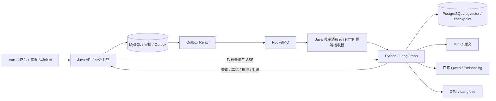

# 知课行 · AI 课程服务平台

知课行面向课程浏览与咨询、知识问答、预约意向和热门课程免费试听。用户登录后在课程广场搜索、筛选和查看详情，再进入 Agent 工作台咨询、查看引用、确认审批与办理结果；Vue 展示过程，Java 掌握身份、库存与订单，独立 Python 服务运行可恢复的 LangGraph 任务。真实模型模式通过一把百炼 Key 使用 `qwen3.7-flash` 和 `text-embedding-v4`（1024 维）；完整 Compose 联调使用 fixture 模型。

「知课行」是当前网站与产品展示名。Java Maven 模块为 `zhikexing-backend`，Python 包为 `zhikexing_agent`，Vue npm 包为 `zhikexing-web`。三个项目副本的 Git `origin` 分别指向对应的知课行 Gitee 地址；Compose 默认使用知课行命名的三个同级目录。

## 三个独立项目

| 项目 | 同级目录 | 当前远程仓库 | 职责 |
|---|---|---|---|
| Java 后端（本仓库） | `zhikexing-backend` | [Git 仓库](https://gitee.com/chy66666/zhikexing-backend.git) | 登录、空间成员、对外 API、审批、业务幂等与 outbox |
| Python Agent 服务 | `zhikexing-agent-runtime` | [Git 仓库](https://gitee.com/chy66666/zhikexing-agent-runtime.git) | LangGraph、checkpoint、事件、知识库、模型适配与评测 |
| Vue 前端 | `zhikexing-web` | [Git 仓库](https://gitee.com/chy66666/zhikexing-web.git) | 知课行登录/注册、产品首页、工作台、免费试听、SSE、审批卡与知识评测 |

Python 是独立目录、独立依赖和独立 Docker 镜像，通过服务接口联动。统一部署由本仓库 Compose 管理，外部项目路径通过 `AGENT_RUNTIME_PATH`、`FRONTEND_PATH` 配置。

在任意开发目录下将三个仓库克隆为同级目录，默认配置即可找到构建上下文：

```sh
git clone git@gitee.com:chy66666/zhikexing-backend.git zhikexing-backend
git clone git@gitee.com:chy66666/zhikexing-agent-runtime.git zhikexing-agent-runtime
git clone git@gitee.com:chy66666/zhikexing-web.git zhikexing-web
cd zhikexing-backend
```

```text
任意开发目录/
├── zhikexing-backend/
├── zhikexing-agent-runtime/
└── zhikexing-web/
```

Compose 默认使用 `../zhikexing-agent-runtime` 和 `../zhikexing-web`，相对于本仓库根目录解析。若目录布局不同，在本机未提交的 `.env` 中设置 `AGENT_RUNTIME_PATH` 和 `FRONTEND_PATH`；不需要修改源码，也不要提交其他机器无法访问的绝对路径。现有 `.env` 不会被初始化脚本覆盖。

## 业务闭环

[课程广场与两级缓存](docs/modules/课程目录与两级缓存.md)提供课程搜索、筛选、分页和详情，并可向 Agent 预填咨询。Java 共用课程查询服务，以 Caffeine + Redis 缓存固定目录和课程展示数据，Redisson 按缓存键协调跨实例重建；库存、鉴权、会话和审批继续使用原有流程。课程价格单位为人民币元，学习周期为天。

课程增量验证（2026-09-29）：新增 14 项 Java 测试通过，包含真实 Redis、MySQL、两个独立 Java 进程与缓存命中后的鉴权；前端构建、Agent 14 项回归和浏览器课程查询/咨询预填检查通过。三个应用镜像已重建，完整 `app`、`observability` Compose 启动正常；8088 同源 API 实测通过课程列表、校区、去空白搜索、详情、401/404，并观测到两级缓存命中和回源指标。真实浏览器完成注册、退出、重新登录、课程搜索、详情和 Agent 咨询预填，预填未创建会话或任务，页面与控制台无错误或警告。测试不代表生产吞吐指标，部署范围见[部署验证记录](docs/deployment/Docker部署验证记录.md)。

[免费试听名额秒杀与 Agent 联动模块](docs/modules/免费试听秒杀与Agent联动.md)在 `/agent` 工作台提供“免费试听”标签：成员浏览活动、直接抢课并查看本人持久参与记录，刷新或换设备后可继续追踪；空间 OWNER 选择课程和校区，创建、发布、暂停活动并查看对账。用户也可在对话中批准 Agent 的试听申请草稿。RocketMQ 事务回调通过 Redis Lua 预占名额，消费者异步创建 0 元试听订单。持久请求、MySQL 条件库存和唯一约束支持重试恢复；HTTP 202 仅表示受理，只有请求最终 `SUCCEEDED` 且有 `orderId` 才表示抢到名额。[验证记录](docs/modules/免费试听秒杀验证记录.md)列出实测范围。

验证边界（2026-09-26）：隔离 MySQL 8.4.8 的 Flyway V1–V7 迁移与雪花主键业务集成、Java 单测及前端构建通过；隔离真实 Redis/RocketMQ 的 15+3 项测试通过。知课行完整 Compose 已健康启动，`Verify-Compose.ps1` 在真实 MySQL、Redis、RocketMQ、Java、Python 与 fixture 模型下完成直接抢课和 Agent 审批落单。Playwright CLI 经真实 8088 入口完成注册、登录、首页、Agent 工作台及试听页面操作，控制台没有错误。真实百炼模型、真实 API 下 MEMBER 权限与浏览器内 Agent 审批、跨设备和网络故障仍未验收；隔离并发测试不代表生产吞吐。

登录保护增量（2026-09-29）：登录/注册共享全局 20 次/秒和每实例 4 个认证并发槽，账号密码校验最多 10 次/分钟；10 分钟内失败 5 次后冷却 60 秒，每账号最多保留 3 个登录会话。Java 新增 10 项流程测试和 12 项真实 Redis 测试通过，前端构建及 mock API 倒计时/401 跳转检查通过，Agent 14 项隔离回归通过。完整 Compose 已更新；8088 真实 API 验证第 4 个会话淘汰最早会话、退出后 401，以及失败冷却期间正确密码仍返回 429 和 `Retry-After`。升级前 Token 需重新登录，浏览器内会话淘汰与任务续跑仍未联调。参数和复现步骤见[登录保护](docs/modules/登录保护.md)。

1. 上传 PDF/TXT/Markdown，原文件存入 MinIO，异步解析、切块和向量化，完整版本发布后才参与检索。
2. Agent 查询授权知识库、课程和校区，展示检索证据与工具结果。
3. 预约工具生成草稿，LangGraph 持久化暂停，等待用户批准。
4. Java 复核身份、审批版本、有效期和运行取消标记，以稳定 actionId 幂等写入预约。
5. Agent 查询真实业务结果后回答；页面可重放事件和查看完整历史。服务重启后从 checkpoint 恢复。



## 技术与工程约束

- Java 21、Spring Boot 4.1.1、Spring AI 2.0.1、MyBatis-Plus 3.5.17、Flyway；Redis 登录态、BCrypt 密码渐进升级。[登录保护](docs/modules/登录保护.md)提供校验前限流、认证并发上限、失败冷却和每账号会话数量限制。
- Caffeine + Redis 缓存课程默认列表、固定目录和详情；Redisson 按键协调跨实例回源。网页、Agent 工具与试听选项共用课程查询服务，筛选搜索直接访问 MySQL，详见[课程目录与两级缓存](docs/modules/课程目录与两级缓存.md)。
- MySQL 业务表的新写入主键采用应用生成的雪花 ID，默认单实例节点号 0；多 Java 写入实例须配置互不冲突的 `SNOWFLAKE_NODE_ID`（0–1022，1023 留给迁移与演示数据）。Flyway V1–V7 管理业务结构，聊天记录和 PDF 文件表名分别为 `zhikexing_chat_record`、`zhikexing_pdf_file`；应用表不设物理外键，服务层校验逻辑关联，数据库唯一键与事务约束保留。
- Python 3.13、FastAPI、LangGraph、PostgreSQL checkpoint、pgvector；通过 HTTP 幂等接收运行命令。
- Vue 3、TypeScript、Pinia、Naive UI；可取消、按事件序号恢复的 SSE。
- RocketMQ 5.5.1 原生 Java client、持久化 outbox 和消费去重。Java 桥接消费者在 Python Run/取消状态事务落盘后确认，允许重复投递；业务唯一约束保证同一 actionId 只生成一笔预约。免费试听使用独立的事务消息 Topic：半消息 → Lua 预占 Redis → commit → 异步落单。
- 单 worker 同时执行多个任务；PostgreSQL advisory lock 阻止误启动多个竞争 worker。审批期间不占用模型请求和未确认队列消息。
- 混合检索是向量召回与中文词项排名的 RRF 融合，当前词法实现不称为 BM25。
- 运行固定图、提示词、工具 Schema 与模型配置，限制步骤、工具调用、Token、超时和费用。
- 规则评测保存逐例答案、引用、用量及延迟；无参考断言的样本显示未评分，不自动算成功。

## Docker 启动

完整安装、端口、环境变量、备份恢复与故障处理见 [Docker 部署文档](docs/deployment/Docker部署文档.md)。支持 Docker Desktop、Linux Docker Engine 或 WSL 内 Docker Engine，仓库不依赖固定盘符、用户名或 WSL 数据目录。

以下命令在 Java 仓库根目录的 PowerShell 7 中运行，示例使用 WSL Docker Engine。已有 `.env` 不重复初始化；WSL 默认使用系统默认发行版，可通过 `ZHIKEXING_WSL_DISTRIBUTION` 选择已安装的发行版：

```powershell
.\deploy\Start-WslEngine.ps1
# 仅首次初始化；已有 .env 时跳过。
.\deploy\Initialize-Environment.ps1 -Wsl
$env:AI_PROVIDER = 'fixture'
.\deploy\Compose.ps1 -Wsl --profile app --profile observability up -d --build --wait
```

上述 fixture 模式用于可复现的完整业务联调；也可在本机未提交的 `.env` 持久设置 `AI_PROVIDER=fixture` 并省略临时 PowerShell 赋值。`Compose.ps1 -Wsl` 只转发当前 PowerShell 进程中非空的覆盖变量，避免空变量遮蔽 `.env`。MySQL、Redis、RocketMQ、Java/Python 与 Nginx 仍连接真实容器。接入百炼时改设 `AI_PROVIDER=bailian`，提供 `DASHSCOPE_API_KEY` 后重建 Runtime；Vue 不读取模型密钥。真实凭据保留在环境与被 Git 忽略的本地 `.env`，数据库和内部服务凭据与模型 Key 分开管理。

Docker Desktop 使用同一初始化脚本，跳过 `Start-WslEngine.ps1`，Compose 包装命令去掉 `-Wsl`。Linux 开发者可使用 PowerShell 7 初始化配置，再在仓库根目录直接执行 `docker compose --profile app --profile observability up -d --build`。

主要入口：

| 服务 | 本机地址 |
|---|---|
| 知课行登录 / 注册 | http://localhost:8088/login · http://localhost:8088/register |
| 产品首页（登录后） | http://localhost:8088/ |
| 课程广场（登录后） | http://localhost:8088/courses |
| Agent 工作台（含“免费试听”标签） | http://localhost:8088/agent |
| Java API | http://localhost:18080 |
| Java 健康检查 | 容器内 `http://localhost:8081/actuator/health`，管理端口不映射到宿主机 |
| Python 健康检查 | http://localhost:18000/health |

在宿主机检查 Java 健康状态：`.\deploy\Compose.ps1 -Wsl exec -T backend curl -fsS http://localhost:8081/actuator/health`，返回 `status: UP`。不要将容器内管理端口当作宿主机 18081 访问。

导入演示课程与校区后，可运行 `.\deploy\Verify-Compose.ps1` 复验经 8088 Nginx 的直接抢课和 Agent fixture 审批落单；导入命令与数据保留范围见 [Docker 部署文档](docs/deployment/Docker部署文档.md)。

## 开发与验证

- Java：JDK 21 下执行 `mvn -q -DskipTests package`。
- Python：进入独立项目，按其 README 创建虚拟环境、安装 `requirements.lock`，执行 `python -m zhikexing_agent`。
- Vue：进入前端项目，执行 `npm ci`、`npm run build`，本机开发代理指向 Java。
- 真实接口与约束见 [研发接口契约](docs/upgrade-plan/研发接口契约.md)。

[开发与验证记录](docs/upgrade-plan/开发与验证记录.md) 和 [Docker 部署验证记录](docs/deployment/Docker部署验证记录.md) 列出当前可复核结果与未覆盖的真实模型、MEMBER/Agent 浏览器操作、跨设备、故障恢复及容量范围。测试结果不是线上业务规模或效果宣传；专项回归测试作为持续验证保留。

试听秒杀与消息投递回归保留在 Java/Python 测试目录，并接入 CI；复现命令见[试听模块验证记录](docs/modules/免费试听秒杀验证记录.md)。

多 worker fencing、扫描件 OCR、本地 reranker 与多 Agent 对照实验有独立验收条件，当前支持边界以验证记录为准。

## 研发资料

- [产品报告（功能介绍与架构图）](docs/product/产品报告.md)
- [产品功能说明书（研发版）](docs/product/产品功能说明书-研发版.md)
- [完整改造研发方案](docs/upgrade-plan/2027-AI-Agent-改造研发方案.md)
- [模型服务与单 Key 配置](docs/upgrade-plan/模型服务与API配置.md)
- [Java 业务改造与验证](docs/upgrade-plan/Java业务改造与验证记录.md)
- [可观测接入验证](docs/upgrade-plan/可观测接入验证.md)
- [项目演示、面试证据与架构决策](docs/upgrade-plan/项目演示与面试证据.md)
