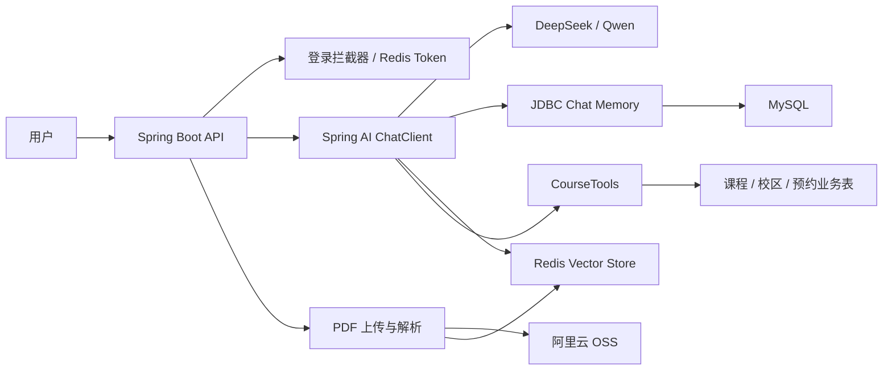

# Intelligent Integrated Interaction Platform

> 基于 Spring Boot 与 Spring AI 构建的智能集成交互平台，集成通用 AI 对话、智能课程客服、ChatPDF 文档问答、会话记忆、用户登录与 PDF 文件管理能力。

## 项目简介

Intelligent Integrated Interaction Platform 是一个面向 AI 交互场景的后端服务项目。项目通过 Spring AI 接入 DeepSeek/Qwen 等大模型能力，结合 MySQL、Redis Vector Store、阿里云 OSS 和 MyBatis-Plus，实现多轮对话、流式输出、RAG 文档问答、Function Calling 工具调用以及用户会话管理。

项目当前主要包含以下场景：

- 通用 AI 聊天：支持基于 `chatId` 的多轮上下文记忆与流式响应。
- 智能课程客服：通过 Spring AI Tool Calling 查询课程、校区并生成课程预约单。
- ChatPDF：上传 PDF 到 OSS，解析并写入 Redis 向量库，支持基于指定会话文档的语义问答。
- AI 生活模拟游戏：使用独立系统提示词和内存会话构建轻量互动游戏。
- 用户体系：注册、登录、登出、昵称修改，登录态存储在 Redis。
- 会话历史：按会话类型维护历史列表、标题、消息记录和删除能力。

## 技术栈

| 分类 | 技术 |
| --- | --- |
| 基础框架 | Spring Boot 3.5.3 |
| AI 框架 | Spring AI 1.0.0 |
| 大模型 | DeepSeek Chat、OpenAI Compatible API（DashScope/Qwen） |
| Embedding | `text-embedding-v4` |
| 向量存储 | Redis Vector Store |
| 数据库 | MySQL |
| ORM | MyBatis-Plus |
| 缓存/登录态 | Redis |
| 文件存储 | 阿里云 OSS |
| 构建工具 | Maven |
| JDK | Java 21 |

## 系统流程



## 目录结构

```text
.
├── pom.xml
├── src
│   ├── main
│   │   ├── java/com/chy/ai
│   │   │   ├── config        # Spring AI、MVC、OSS 配置
│   │   │   ├── controller    # 用户、聊天、PDF、历史、客服、游戏接口
│   │   │   ├── entity        # PO、VO、Query 对象
│   │   │   ├── mapper        # MyBatis-Plus Mapper
│   │   │   ├── service       # 业务服务接口与实现
│   │   │   ├── tools         # Spring AI Tool Calling 工具
│   │   │   └── util          # Token、拦截器、OSS、密码工具
│   │   └── resources
│   │       ├── application.yaml
│   │       └── mapper        # MyBatis XML
│   └── test
└── README.md
```

## 环境要求

启动前请准备：

- JDK 21+
- Maven 3.9+
- MySQL 8.x
- Redis Stack 或支持 RediSearch/向量索引能力的 Redis 环境
- DeepSeek API Key
- DashScope API Key（用于 OpenAI Compatible 模式与 Embedding）
- 阿里云 OSS Bucket 与访问密钥

## 快速启动

### 1. 克隆项目

```bash
git clone https://github.com/Chen166-cloud/Intelligent-integrated-interaction-platform.git
cd Intelligent-integrated-interaction-platform
```

### 2. 创建数据库

项目默认连接的数据库为 `spring-ai-demo`，可在 `src/main/resources/application.yaml` 中修改：

```sql
CREATE DATABASE IF NOT EXISTS `spring-ai-demo`
  DEFAULT CHARACTER SET utf8mb4
  DEFAULT COLLATE utf8mb4_unicode_ci;
```

### 3. 配置环境变量

`application.yaml` 中通过占位符读取大模型与 OSS 凭证：

| 环境变量 | 用途 |
| --- | --- |
| `DEEPSEEK_API_KEY` | DeepSeek 模型 API Key |
| `API-KEY` | DashScope/OpenAI Compatible API Key |
| `OSS_ACCESS_KEY_ID` | 阿里云 OSS AccessKey ID |
| `OSS_ACCESS_KEY_SECRET` | 阿里云 OSS AccessKey Secret |

PowerShell 示例：

```powershell
$env:DEEPSEEK_API_KEY = "your-deepseek-api-key"
Set-Item Env:API-KEY "your-dashscope-api-key"
$env:OSS_ACCESS_KEY_ID = "your-oss-access-key-id"
$env:OSS_ACCESS_KEY_SECRET = "your-oss-access-key-secret"
```

如果你的 Shell 不方便设置带 `-` 的环境变量，也可以在启动时通过 JVM 参数传入：

```bash
mvn spring-boot:run -Dspring-boot.run.jvmArguments="-DAPI-KEY=your-dashscope-api-key"
```

### 4. 修改本地配置

根据你的本地环境调整 `src/main/resources/application.yaml`：

```yaml
spring:
  datasource:
    url: jdbc:mysql://localhost:3306/spring-ai-demo?serverTimezone=Asia/Shanghai&useUnicode=true&characterEncoding=utf-8&allowPublicKeyRetrieval=true&useSSL=false
    username: root
    password: 1234

  data:
    redis:
      host: 127.0.0.1
      port: 6379

aliyun:
  oss:
    endpoint: https://oss-cn-shanghai.aliyuncs.com
    bucketName: your-bucket-name
    region: cn-shanghai
```

### 5. 启动项目

```bash
mvn spring-boot:run
```

启动成功后，服务默认监听：

```text
http://localhost:8080
```

## 数据库表结构参考

仓库当前没有独立的数据库 migration 文件。下面 SQL 根据实体类和当前业务逻辑整理，可作为本地初始化参考。

```sql
CREATE TABLE IF NOT EXISTS `user_info` (
  `id` BIGINT NOT NULL AUTO_INCREMENT,
  `user_name` VARCHAR(64) NOT NULL,
  `password` VARCHAR(255) NOT NULL,
  `nick_name` VARCHAR(64) DEFAULT NULL,
  `create_time` DATETIME DEFAULT CURRENT_TIMESTAMP,
  `update_time` DATETIME DEFAULT CURRENT_TIMESTAMP ON UPDATE CURRENT_TIMESTAMP,
  PRIMARY KEY (`id`),
  UNIQUE KEY `uk_user_name` (`user_name`)
) ENGINE=InnoDB DEFAULT CHARSET=utf8mb4;

CREATE TABLE IF NOT EXISTS `iiip_chat_record` (
  `id` VARCHAR(128) NOT NULL,
  `title` VARCHAR(255) DEFAULT NULL,
  `user_id` BIGINT NOT NULL DEFAULT 1,
  `type` VARCHAR(32) NOT NULL,
  `create_time` DATETIME DEFAULT CURRENT_TIMESTAMP,
  PRIMARY KEY (`id`),
  KEY `idx_type_user_time` (`type`, `user_id`, `create_time`)
) ENGINE=InnoDB DEFAULT CHARSET=utf8mb4;

CREATE TABLE IF NOT EXISTS `spring_ai_chat_memory` (
  `id` BIGINT NOT NULL AUTO_INCREMENT,
  `conversation_id` VARCHAR(128) NOT NULL,
  `content` TEXT NOT NULL,
  `type` VARCHAR(32) NOT NULL,
  `timestamp` DATETIME NOT NULL,
  PRIMARY KEY (`id`),
  KEY `idx_conversation_id` (`conversation_id`)
) ENGINE=InnoDB DEFAULT CHARSET=utf8mb4;

CREATE TABLE IF NOT EXISTS `iiip_pdf_file` (
  `id` BIGINT NOT NULL AUTO_INCREMENT,
  `chat_id` VARCHAR(128) NOT NULL,
  `user_id` BIGINT NOT NULL DEFAULT 1,
  `original_filename` VARCHAR(255) NOT NULL,
  `oss_bucket` VARCHAR(128) NOT NULL,
  `oss_key` VARCHAR(512) NOT NULL,
  `file_size` BIGINT DEFAULT NULL,
  `content_type` VARCHAR(128) DEFAULT 'application/pdf',
  `vector_index_name` VARCHAR(128) DEFAULT NULL,
  `vector_status` TINYINT DEFAULT 0 COMMENT '0-未入库，1-已入库，2-入库失败',
  `create_time` DATETIME DEFAULT CURRENT_TIMESTAMP,
  `update_time` DATETIME DEFAULT CURRENT_TIMESTAMP ON UPDATE CURRENT_TIMESTAMP,
  PRIMARY KEY (`id`),
  UNIQUE KEY `uk_chat_user` (`chat_id`, `user_id`)
) ENGINE=InnoDB DEFAULT CHARSET=utf8mb4;

CREATE TABLE IF NOT EXISTS `course` (
  `id` INT NOT NULL AUTO_INCREMENT,
  `name` VARCHAR(128) NOT NULL,
  `edu` INT DEFAULT NULL COMMENT '0-无，1-初中，2-高中，3-大专，4-本科及以上',
  `type` VARCHAR(64) DEFAULT NULL,
  `price` BIGINT DEFAULT NULL,
  `duration` INT DEFAULT NULL COMMENT '学习时长，单位：天',
  PRIMARY KEY (`id`)
) ENGINE=InnoDB DEFAULT CHARSET=utf8mb4;

CREATE TABLE IF NOT EXISTS `school` (
  `id` INT NOT NULL AUTO_INCREMENT,
  `name` VARCHAR(128) NOT NULL,
  `city` VARCHAR(64) DEFAULT NULL,
  PRIMARY KEY (`id`)
) ENGINE=InnoDB DEFAULT CHARSET=utf8mb4;

CREATE TABLE IF NOT EXISTS `course_reservation` (
  `id` INT NOT NULL AUTO_INCREMENT,
  `course` VARCHAR(128) NOT NULL,
  `student_name` VARCHAR(64) NOT NULL,
  `contact_info` VARCHAR(128) NOT NULL,
  `school` VARCHAR(128) NOT NULL,
  `remark` VARCHAR(500) DEFAULT NULL,
  PRIMARY KEY (`id`)
) ENGINE=InnoDB DEFAULT CHARSET=utf8mb4;
```

课程客服依赖 `course` 与 `school` 表中的基础数据，可按需插入示例数据：

```sql
INSERT INTO `school` (`name`, `city`) VALUES
('上海校区', '上海'),
('杭州校区', '杭州');

INSERT INTO `course` (`name`, `edu`, `type`, `price`, `duration`) VALUES
('Java 后端开发', 3, '编程', 19900, 180),
('AIGC 设计实战', 2, '设计', 12900, 90),
('短视频运营', 0, '自媒体', 9900, 60);
```

## 核心接口

除 `/user/login`、`/user/register`、`/user/logout` 外，其他接口会经过登录拦截器。登录成功后，将返回的 token 放到请求头：

```http
Authorization: <token>
```

### 用户接口

| 方法 | 路径 | 说明 |
| --- | --- | --- |
| `POST` | `/user/register` | 用户注册 |
| `POST` | `/user/login` | 用户登录，返回 token |
| `POST` | `/user/logout` | 用户登出 |
| `POST` | `/user/nickname` | 修改昵称 |
| `GET` | `/user/me` | 获取当前登录用户 |

注册/登录请求体：

```json
{
  "userName": "test",
  "password": "123456"
}
```

修改昵称请求体：

```json
{
  "nickName": "小虎"
}
```

### AI 对话接口

| 方法 | 路径 | 说明 |
| --- | --- | --- |
| `GET/POST` | `/ai/chat?prompt=你好&chatId=chat-001` | 通用 AI 聊天 |
| `GET/POST` | `/ai/service?prompt=我想学编程&chatId=service-001` | 智能课程客服 |
| `GET/POST` | `/ai/game?prompt=开始游戏&chatId=game-001` | AI 生活模拟游戏 |

这些接口返回 `Flux<String>` 流式文本，响应类型为 `text/html;charset=UTF-8` 或 `text/html;charset=utf-8`。

### ChatPDF 接口

| 方法 | 路径 | 说明 |
| --- | --- | --- |
| `POST` | `/ai/pdf/upload/{chatId}` | 上传 PDF，字段名为 `file` |
| `GET` | `/ai/pdf/file/{chatId}` | 下载当前会话绑定的 PDF |
| `GET/POST` | `/ai/pdf/chat?prompt=问题&chatId=pdf-001` | 基于已上传 PDF 问答 |

上传示例：

```bash
curl -X POST "http://localhost:8080/ai/pdf/upload/pdf-001" \
  -H "Authorization: your-token" \
  -F "file=@./demo.pdf"
```

问答示例：

```bash
curl "http://localhost:8080/ai/pdf/chat?prompt=总结一下这份文档&chatId=pdf-001" \
  -H "Authorization: your-token"
```

### 会话历史接口

`type` 可取值：`chat`、`service`、`pdf`、`game`。

| 方法 | 路径 | 说明 |
| --- | --- | --- |
| `GET` | `/ai/history/{type}` | 获取指定类型的会话 ID 列表 |
| `POST` | `/ai/history/{type}` | 创建会话记录，请求体传入 `{ "id": "chat-001" }` |
| `GET` | `/ai/history/{type}/{chatId}` | 获取会话消息历史 |
| `DELETE` | `/ai/history/{type}/{chatId}` | 删除会话记录和聊天记忆 |
| `GET` | `/ai/history/{type}/titles` | 获取并刷新会话标题列表 |

## 配置说明

### 大模型

当前 `application.yaml` 中默认聊天模型为 DeepSeek：

```yaml
spring:
  ai:
    model:
      chat: deepseek
    deepseek:
      chat:
        options:
          model: deepseek-v4-pro
```

同时配置了 OpenAI Compatible 接口用于 Qwen 与 Embedding：

```yaml
spring:
  ai:
    openai:
      base-url: https://dashscope.aliyuncs.com/compatible-mode
      chat:
        options:
          model: qwen3.7-max
      embedding:
        options:
          model: text-embedding-v4
          dimensions: 1024
```

### Redis Vector Store

ChatPDF 使用 Redis 向量库，默认索引和前缀为：

```yaml
spring:
  ai:
    vectorstore:
      redis:
        initialize-schema: true
        index-name: iiip-pdf-index
        prefix: "iiip:pdf:"
```

上传 PDF 后，项目会：

1. 将原始 PDF 上传到阿里云 OSS。
2. 使用 `PagePdfDocumentReader` 按页读取内容。
3. 对文本进行段落合并和长文本切分。
4. 写入 Redis Vector Store，并附带 `chat_id` 等元数据。
5. 在问答时通过 `chat_id` 过滤，只检索当前会话对应的文档片段。

## 常见问题

### 1. 启动时报数据库连接失败

检查 `spring.datasource.url`、用户名、密码是否正确，并确认 MySQL 中已创建 `spring-ai-demo` 数据库和所需表。

### 2. ChatPDF 检索不到内容

请确认：

- Redis 环境支持向量索引能力。
- `spring.ai.vectorstore.redis.initialize-schema` 为 `true` 或索引已提前创建。
- PDF 已成功上传，并且 `iiip_pdf_file.vector_status = 1`。
- 提问时使用的 `chatId` 与上传 PDF 时的 `chatId` 一致。

### 3. OSS 上传失败

请确认：

- `OSS_ACCESS_KEY_ID` 与 `OSS_ACCESS_KEY_SECRET` 已设置。
- `aliyun.oss.bucketName`、`endpoint`、`region` 与你的 Bucket 匹配。
- 当前 AccessKey 对目标 Bucket 有上传和下载权限。

### 4. 登录后接口仍提示未登录

请确认请求头中携带：

```http
Authorization: 登录接口返回的 token
```

Redis 中登录态 key 的前缀为 `login:token:`，默认过期时间为 1440 分钟。

## 开发说明

运行测试：

```bash
mvn test
```

打包：

```bash
mvn clean package
```

运行 Jar：

```bash
java -jar target/intelligent-integrated-interaction-platform-0.0.1-SNAPSHOT.jar
```

## 后续可优化方向

- 增加 Flyway/Liquibase 数据库迁移脚本。
- 将 API Key 占位符统一为更易跨平台配置的变量名，例如 `DASHSCOPE_API_KEY`。
- 为 ChatPDF 增加文档删除时的向量清理能力。
- 增加 Swagger/OpenAPI 文档。
- 为核心业务接口补充 Mock 测试和集成测试。
