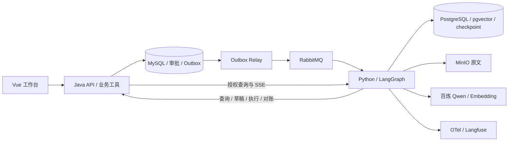

# Intelligent Integrated Interaction Platform

面向课程咨询与知识问答的 Agent 工程项目。Vue 展示执行过程与审批，Java 掌握业务权限和预约事务，独立 Python 服务运行可恢复的 LangGraph 任务。默认通过一把百炼 Key 使用 `qwen3.7-flash` 和 `text-embedding-v4`（1024 维）。

## 三个独立项目

| 项目 | 本机位置 | 职责 |
|---|---|---|
| Java 后端（本仓库） | `D:/java/SpringAI/intelligent-integrated-interaction-platform` | 登录、空间成员、对外 API、审批、业务幂等与 outbox |
| Python：intelligent-agent-runtime | `D:/develop/intelligent-agent-runtime` | LangGraph、checkpoint、事件、知识库、模型适配与评测 |
| Vue 前端 | `D:/develop/web-intelligent-integrated-interaction-platform` | 工作台、SSE、审批卡、引用预览、知识与评测管理 |

Python 是独立目录、独立依赖和独立 Docker 镜像，通过服务接口联动。统一部署由本仓库 Compose 管理，外部项目路径通过 `AGENT_RUNTIME_PATH`、`FRONTEND_PATH` 配置。

## 业务闭环

1. 上传 PDF/TXT/Markdown，原文件存入 MinIO，异步解析、切块和向量化，完整版本发布后才参与检索。
2. Agent 查询授权知识库、课程和校区，展示检索证据与工具结果。
3. 预约工具生成草稿，LangGraph 持久化暂停，等待用户批准。
4. Java 复核身份、审批版本、有效期和运行取消标记，以稳定 actionId 幂等写入预约。
5. Agent 查询真实业务结果后回答；页面可重放事件和查看完整历史。服务重启后从 checkpoint 恢复。



## 技术与工程约束

- Java 21、Spring Boot 4.1.1、Spring AI 2.0.1、MyBatis-Plus 3.5.17、Flyway；Redis 登录态、BCrypt 密码渐进升级。
- Python 3.13、FastAPI、LangGraph、PostgreSQL checkpoint、pgvector、AIO Pika。
- Vue 3、TypeScript、Pinia、Naive UI；可取消、按事件序号恢复的 SSE。
- RabbitMQ 持久消息、publisher confirm、outbox 租约和消费去重。允许重复投递，业务唯一约束保证同一 actionId 只生成一笔预约。
- 单 worker 同时执行多个任务；PostgreSQL advisory lock 阻止误启动多个竞争 worker。审批期间不占用模型请求和未确认队列消息。
- 混合检索是向量召回与中文词项排名的 RRF 融合，当前词法实现不称为 BM25。
- 运行固定图、提示词、工具 Schema 与模型配置，限制步骤、工具调用、Token、超时和费用。
- 规则评测保存逐例答案、引用、用量及延迟；无参考断言的样本显示未评分，不自动算成功。

## Docker 启动

完整安装、端口、环境变量、备份恢复与故障处理见 [Docker 部署文档](docs/deployment/Docker部署文档.md)。本机实际使用 Ubuntu-22.04 内的 Docker Engine，WSL 数据目录已迁到 `E:/WSL/IIIP-Ubuntu-22.04`。

首次配置（已有 `.env` 不重复初始化）：

```powershell
.\deploy\Start-WslEngine.ps1
.\deploy\Initialize-Environment.ps1 -Wsl
# 兼容已有 Windows 环境变量；只在当前进程映射，不显示 Key。
$env:DASHSCOPE_API_KEY = [Environment]::GetEnvironmentVariable('API-KEY')
.\deploy\Compose.ps1 -Wsl --profile app --profile observability up -d --build
```

如果已经使用规范变量 `DASHSCOPE_API_KEY`，跳过映射步骤。真实凭据保留在环境与被 Git 忽略的本地 `.env`；Vue 不读取模型密钥。数据库和内部服务凭据与模型 Key 分开管理。

主要入口：

| 服务 | 本机地址 |
|---|---|
| 工作台 | http://localhost:8088/agent |
| Java API | http://localhost:18080 |
| Java 健康检查 | 容器内 `http://localhost:8081/actuator/health`，管理端口不映射到宿主机 |
| Python 健康检查 | http://localhost:18000/health |

在宿主机检查 Java 健康状态：`.\deploy\Compose.ps1 -Wsl exec -T backend curl -fsS http://localhost:8081/actuator/health`，返回 `status: UP`。不要将容器内管理端口当作宿主机 18081 访问。

旧 Spring AI 聊天、客服和游戏代码默认关闭（`LEGACY_AI_ENABLED=false`），旧入口返回迁移提示。新主线不需要 DeepSeek Key，也不依赖旧 Redis 向量索引。旧数据库不自动复制到演示数据库，数据迁移需先备份并按部署文档执行。

## 开发与验证

- Java：JDK 21 下执行 `mvn -q -DskipTests package`。
- Python：进入独立项目，按其 README 创建虚拟环境、安装 `requirements.lock`，执行 `python -m iiip_agent`。
- Vue：进入前端项目，执行 `npm ci`、`npm run build`，本机开发代理指向 Java。
- 真实接口与约束见 [研发接口契约](docs/upgrade-plan/研发接口契约.md)。

[开发与验证记录](docs/upgrade-plan/开发与验证记录.md) 区分模拟模型回归、真实数据库回归和真实模型整链路结果；[Docker 部署验证记录](docs/deployment/Docker部署验证记录.md) 记录实际容器检查。测试结果不是线上业务规模或效果宣传。按本次开发要求，验证后删除新增临时测试类和脚本，保留生产评测功能及去敏报告，已有测试不擅自删除。

多 worker fencing、扫描件 OCR、本地 reranker 与多 Agent 对照实验有独立验收条件，当前支持边界以验证记录为准。

## 研发资料

- [产品功能说明书（研发版）](docs/product/产品功能说明书-研发版.md)
- [完整改造研发方案](docs/upgrade-plan/2027-AI-Agent-改造研发方案.md)
- [模型服务与单 Key 配置](docs/upgrade-plan/模型服务与API配置.md)
- [Java 业务改造与验证](docs/upgrade-plan/Java业务改造与验证记录.md)
- [可观测接入验证](docs/upgrade-plan/可观测接入验证.md)
- [项目演示、面试证据与架构决策](docs/upgrade-plan/项目演示与面试证据.md)
