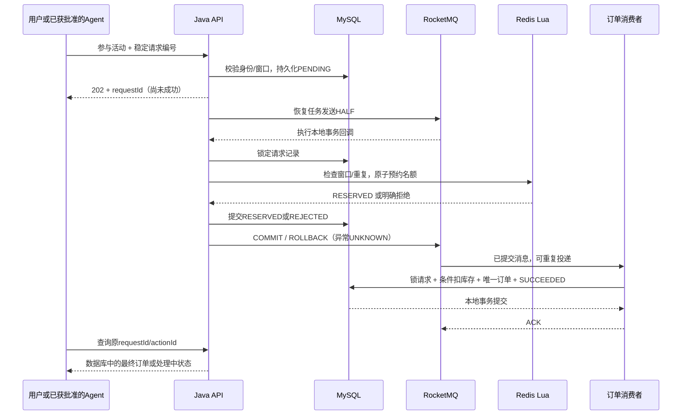

# 免费试听名额秒杀与 Agent 联动

设计与实现日期：2026-09-25。目标是交付一个可以解释一致性边界、复现故障和证明业务结果的后端模块，同时服务 Java 后端和 AI Agent 求职。岗位依据见[本次调研](../research/2026-09-25-秒杀模块岗位与技术调研.md)；代码复用依据见[参考实现差异](../research/参考秒杀实现与迁移差异.md)。

当前状态：三个仓库源码及 Compose 配置已更新，隔离真实中间件和跨服务 fixture 联调通过；常用完整 Compose 尚未按新版重建验收。本页的“实现”指源码与上述验证条件，不代表当前常用部署已切换。

## 1. 业务范围与工程选择

空间所有者为现有课程和校区发布免费试听活动；空间成员在指定窗口争抢有限名额。成功后获得一笔 0 元、CONFIRMED 状态的试听订单。普通课程咨询预约继续使用原表和原流程，试听秒杀有独立活动、请求与订单模型。

本次实现包括活动创建/发布/暂停、查询、本人抢课及结果查询、身份隔离、限流、预占、异步落单、事务回查、失败恢复、补偿、只读对账、指标和 Agent 审批工具。没有引入支付、退款、短信或预约取消。活动发布后不编辑窗口、课程与名额；一次活动每个用户只有一笔参与请求，失败后也查原请求，重新营销需要新活动。

前端只扩展已有审批卡，管理活动与直接抢课目前使用 REST API；没有把本轮描述成已完成独立营销运营页面。

### 为什么值得放进简历

| 岗位能力 | 项目中可以展示的证据 |
|---|---|
| MySQL / Redis / MQ 原理与异步服务 | 短 Lua、半消息、本地回调、持久回查、SQL 条件更新、业务唯一键 |
| 并发正确性 | 40 人争抢 8 个名额，成功请求三次重复消费，最终只有 8 笔订单 |
| 故障恢复 | Lua 成功后记录未提交、缓存丢失、数据库库存冲突、消费重试与原请求重驱 |
| Agent 工程 | 稳定 actionId、人工审批、可信身份、图暂停恢复、跨轮查原动作、确定性业务回执 |
| 可维护性 | Flyway、版本化消息、集成回归、指标、隔离演练环境、MQ 迁移操作说明 |

这些能力映射到官方岗位要求，不代表字节、阿里、腾讯统一采用本项目的组件组合。腾讯样本包含社招和未标届次岗位，不能写成 2027 校招要求。

## 2. 中间件与职责

| 组件 | 本模块职责 | 部署变化 |
|---|---|---|
| MySQL 8.4 | 活动、库存最终账、参与请求/事务结果、唯一报名、订单、审批 | 复用；V5 新建三表，审批增加工具类型 |
| Redis | 活动窗口、原子预占、同用户去重、请求回执、每用户限流 | 复用；AOF + noeviction；活动数据不自动过期 |
| RocketMQ Broker 5.5.0 / Java client 5.5.1 | 试听事务消息与 Agent 普通命令；重试/DLQ | 同一套 MQ 两个独立 Topic |
| PostgreSQL / LangGraph checkpoint | Agent 运行、事件与图恢复 | 复用；不保存试听业务库存或订单真相 |
| Prometheus / Grafana | 消费重试、事务 UNKNOWN、Broker 指标和运行观测 | 复用；新增 `trial.*` Micrometer 指标 |

没有为秒杀增加 Redisson 分布式锁、Seata、另一种 MQ 或独立向量库。MySQL 行锁只解决本数据库事务中的串行化；Lua 解决单 Redis 槽内原子决策，两者不是跨系统原子事务。

Java 使用原生 RocketMQ remoting client，避免给 Spring Boot 4 加入旧 Boot 自动配置。Broker 镜像固定为实际可取得的 5.5.0，客户端为 Maven 中可取得的 5.5.1；真实 Broker 集成回归验证该组合，而不是只凭版本号假定兼容。

Python 不运行 MQ consumer，也不安装 RocketMQ 原生客户端。Java 的普通消息消费者把命令交给内部 HTTP 接口，Python 持久化 Run/取消状态后返回 2xx，Java 才确认消费。Python 用 Run 主键与 request_hash 幂等，没有独立 inbox 表。

## 3. 请求与状态流



`PENDING → RESERVED → SUCCEEDED` 是成功路径。Lua 明确拒绝则 `PENDING → REJECTED`；数据库库存兜底拒绝则 `RESERVED → REJECTED` 并持久化待补偿标记。数据库/Redis 无法判断结果时保持处理中，不凭网络超时宣称失败。

| 返回状态 | 可以向用户承诺什么 |
|---|---|
| PENDING | 请求已持久化，尚未确认名额 |
| RESERVED | 准入成功，最终订单仍在处理 |
| SUCCEEDED + 非空 orderId | 数据库订单已提交，获得免费试听资格 |
| REJECTED | 本次参与未获得资格，reason 给出原因 |

查询页面显示的 `remaining` 是数据库未确认名额，不是实时可抢数量，不能据此承诺用户必抢到。请求受理顺序、消息发送顺序与最终获资格顺序也不等同于严格先到先得。

## 4. 保证什么，以及如何实现

### 4.1 可恢复的准入

发送 HALF 之前先保存 `trial_claim_request`。这条记录本身不扣库存。发送回调在请求行锁内执行 Lua，然后将结果保存到同一请求记录。数据库事务提交以后才返回 COMMIT。

如果 Lua 成功但进程在提交记录前退出，请求仍为 PENDING；恢复任务重发相同 requestId，Lua 用回执返回原结果而不是再次扣减，之后补上数据库记录。Broker 回查只读持久状态：RESERVED/SUCCEEDED 返回 COMMIT，REJECTED 返回 ROLLBACK，PENDING 或依赖异常返回 UNKNOWN。

恢复任务每轮领取最多 30 条 PENDING/RESERVED 请求，使用 `FOR UPDATE SKIP LOCKED` 与 `next_attempt_at` 防止多个实例立刻反复领取，30 秒后仍未完成可以再次发送。它是可重复的恢复任务，不是 exactly-once 租约。应用重启、发送异常、半消息被 Broker 超时清理及已接收消息进入 DLQ，都不会删除业务请求。原请求重驱依然走同一幂等消费入口。

RocketMQ 的事务消息只协调生产者事务与消息提交，不替消费端保证业务成功。官方资料：[事务消息机制与限制](https://rocketmq.apache.org/docs/featureBehavior/04transactionmessage/)。

### 4.2 不超卖与不重复发放

Redis Lua 用活动库存哈希、用户占位哈希与请求回执哈希，三把键都含同一个 `{campaignId}`。Redis TIME 检查开始/结束时间，不相信客户端时间。脚本短且无遍历。

MySQL 消费事务先锁请求，只有 RESERVED 才能处理；执行 `UPDATE trial_campaign SET remaining=remaining-1 WHERE id=? AND remaining>0`，成功后插入订单并将请求改为 SUCCEEDED。重复消息读到终态直接确认。订单与请求均有 `(campaign_id, actor_id)` 唯一约束，订单另有 request_id 唯一约束，库存有 CHECK 约束。

MySQL 是最终事实来源。Redis 复制/AOF 仍可能丢失写入，因此可能出现额外准入但被数据库拒绝；不能把这种路径描述成每次预占都保证最终成单。

### 4.3 缓存丢失与补偿

已经发布的活动不会因再次调用 publish 而重建缓存。没有 Redis 库存时禁止按数据库 remaining 热重建，因为它没有扣除尚未落单的在途预占。请求保持 UNKNOWN/PENDING，运营可以暂停活动并查看对账。

数据库明确拒绝后才设置 `release_pending=true`。补偿脚本要求同 requestId、同 actor、原 RESERVED 回执都匹配，成功释放或已释放才能清掉待补偿标记；记录缺失不记为补偿完成。消费者短暂失败和 DLQ 不直接退库存。

Redis receipts 不设置短 TTL；清理必须在活动结束、无在途请求、消费与回查保留窗口结束并归档之后另行执行。本版没有自动清理或自动重建接口，避免把不可判断的请求静默变成超卖入口。

### 4.4 身份、审批与请求重放

公网从现有登录态取得 actor；内部工具校验内部 token 和 Java 中的可信 run/actor/workspace。模型只能提供活动编号或之前的 actionId，不能指定代抢用户、金额或增加库存。

Direct 与 Agent 的新请求进入同一用户限流，默认每秒 5 次。已存在的同内容请求返回原回执，不重新计一次参与；同一个请求编号换活动返回 409。请求编号按空间、用户、来源隔离，Agent actionId 在同用户/空间内唯一。

普通预约的审批类型是 `reserve_course`，抢课是 `claim_trial`；执行接口校验类型，防止串用审批。批准不提前占名额，也不保证活动开始时有库存。执行与取消锁定同一 run：取消先提交会挡住新的业务申请；申请已受理后，停止 Agent 不撤销业务。

草稿包含不可编辑的活动快照，执行校验 args_hash、审批期限及动作归属。发布后的活动本身不可编辑，因此本轮无需额外的活动版本 CAS。

## 5. Agent 用户体验

1. 用户询问“有哪些可以免费试听的 Agent 课程”，调用 `query_trial_campaigns`。
2. 用户明确要参加某活动，调用 `draft_trial_claim`；稳定 actionId 由 runtime 使用 runId/tool_call_id 生成，重试不换号。
3. 现有审批卡展示课程、校区、窗口、0 元及“不保证有名额”；LangGraph 持久化暂停。
4. 用户批准后调用 `execute-trial-claim`，然后最多查询 3 次，间隔 1 秒。
5. 图用结构化结果直接生成回执；PENDING/RESERVED 明确显示处理中，不交给模型自由改写成成功。
6. 新一轮对话可通过 `query_trial_claim(actionId)` 查询本人同空间此前的申请，无须重新参与活动。

工具查询名额/状态不走 30 秒读缓存。运行状态完成只说明 Agent 已答复，不代表订单一定成功。旧正在运行/待审批图任务应先排空再升级 runtime 图版本，不能将旧 checkpoint 冒充新图状态。

## 6. 数据表与接口

| 表 | 内容 |
|---|---|
| trial_campaign | workspace、课程/校区、窗口、容量、数据库剩余名额、DRAFT/LIVE/PAUSED |
| trial_claim_request | 身份、幂等键、来源、run/action/approval、状态、原因、补偿标记、重试时刻 |
| trial_order | request 唯一、活动/用户唯一、0元、CONFIRMED、创建时间 |
| agent_approval 新列 tool_name | 区分普通预约与试听抢课，旧数据默认 reserve_course |

公共前缀：`/api/v1/workspaces/{workspace}/trials`，必须携带现有登录令牌。

| 方法/相对路径 | 权限/用途 |
|---|---|
| POST /campaigns | OWNER；创建草稿 |
| POST /campaigns/{id}/publish | OWNER；首次预热与发布，要求启用 RocketMQ |
| POST /campaigns/{id}/pause | OWNER；停止新准入，已预占请求继续完成 |
| GET /campaigns、/campaigns/{id} | 空间成员；活动查询 |
| POST /campaigns/{id}/claims | 成员；body `{ "clientRequestId": "稳定唯一编号" }`，202回执 |
| GET /claims/{requestId} | 本人；查询状态与订单编号 |
| GET /campaigns/{id}/reconciliation | OWNER；只读数据库守恒、在途/补偿数量和缓存快照 |

创建示例（编号换成已有课程和校区，窗口换成未来或当前有效 UTC 时间）：

```json
{
  "title": "AI Agent 工程实战免费试听",
  "courseId": "1",
  "schoolId": "1",
  "capacity": 8,
  "startsAt": "2026-09-26T01:00:00Z",
  "endsAt": "2026-09-26T01:10:00Z"
}
```

内部工具前缀 `/internal/v1/tools`：GET `/trial-campaigns`；POST `/draft-trial-claim`（actionId/campaignId）；POST `/execute-trial-claim`（actionId/approvalId）；GET `/trial-claims/by-action/{actionId}`。沿用现有 `/approvals/{id}` 和公共审批决定接口。

事务 Topic 为 `iiip_trial_claims`，生产组 `iiip_trial_tx_v1`，消费组 `iiip_trial_order_v1`。消息 body 只有 `{ "schemaVersion": 1, "requestId": "UUID" }`，数据库查询可信上下文，避免将用户资料和可变价格装进消息。普通 Agent Topic 为 `iiip-agent-commands`。

## 7. 故障演练与运维

| 故障点 | 处理和观测 |
|---|---|
| 保存PENDING后未发HALF即退出 | 调度恢复领取并发送；客户端一直查原requestId |
| HALF发送超时 | 保留PENDING，不推断没发出去；回查与重驱可重复 |
| Lua成功后数据库事务回滚 | 相同请求重放Lua回执，再提交持久决定 |
| 二阶段提交丢失 | Broker回查读取持久请求状态 |
| 数据库提交订单后ACK丢失 | 重复消息读SUCCEEDED，唯一约束防止重复发放 |
| Redis不可用/库存缺失 | UNKNOWN，暂停准入，对账；禁止直接补满容量 |
| 数据库remaining不足 | REJECTED/DB_SOLD_OUT，持久化补偿待办 |
| 补偿回执缺失 | 保留release_pending，人工对账，不虚报完成 |
| Agent命令进入DLQ | 修复故障后按原outbox id单条重驱，见部署文档 |
| 试听事务消息进入DLQ/过期 | RESERVED恢复任务仍重发原requestId；监控重复失败并人工修复 |

指标：`trial_transaction_total{phase,decision}`、`trial_consume_total{outcome}`、`trial_send_total{outcome}`。这些计数包含重试，不是唯一成功订单数；成功规模以订单表为准。Broker 指标和对账接口用于定位积压/补偿，不把 UNKNOWN 自动解释为失败。

部署与既有环境消息迁移步骤见[Docker部署文档](../deployment/Docker部署文档.md)。先停止新运行并盘点待处理队列/outbox，再升级 Java/Python/Flyway 和启动 RocketMQ Topic/Group；不能删除仍有待投递业务的队列。开发 HTTP 模式仍可用于普通 Agent，试听抢课写入口要求 ROCKETMQ_ENABLED=true。

缓存丢失恢复操作：先暂停活动，保留请求/订单/旧缓存备份，确认所有持久 RESERVED 请求最终处理，再对 PENDING 中缺少回执的请求作人工裁决；结束受影响活动并新建活动是最保守的恢复方式。本版不提供“一键把库存设回remaining”接口。若要恢复同一活动，必须先实现代际 fencing、未知请求裁决和冻结期间重建协议，这仍属于后续研发范围。

## 8. 性能边界与后续有价值的研发

当前实现刻意在 HALF 之前写持久请求，解决“用户已受理但任务凭空消失”的恢复问题，代价是数据库接收每个有效新参与请求。成员行按用户串行化，不锁整场活动；最终订单仍由活动库存行顺序扣减。默认30条/轮的发送恢复器及网络往返也会限制吞吐。

因此，现有并发正确性回归不能换算成“万级QPS”或“大厂同款性能”。若要进一步提升，先采集准入/落单/查询分别的延迟、队列积压、数据库锁等待与CPU，再决定：缓存售罄前置过滤、资格票据、入口整体过载保护、受控并发发送、分桶名额或分区消费。不能在无测试数据时先叠加分库分表和分布式锁。

目前每用户限流不是完整反作弊：没有设备/IP风控、验证码和账户成本控制。工作空间OWNER也不是独立营销平台管理员角色。生产化还需要MQ ACL/TLS、Broker副本/故障切换、Redis隔离与容量告警、审计留存和原始请求归档策略。

## 9. 代码入口与验证

- Java：`src/main/java/com/chy/ai/trial`，对应脚本 `src/main/resources/lua/trial-*.lua` 与 `V5__trial_flash_sale.sql`。
- MQ迁移：`RocketMqConfiguration`、`RocketMqOutboxPublisher`、`AgentCommandMessageListener`、`deploy/rocketmq`。
- Python：独立仓库 `iiip_agent/tools.py`、`runtime.py`，工具图、结果回执与回归。
- [隔离验证操作和结果](免费试听秒杀验证记录.md)。所有业务测试数据均为合成数据，没有运行旧的计费模型测试。

简历可以据实描述为“实现基于 Redis Lua 与 RocketMQ 事务消息的免费试听名额异步抢课模块，使用持久请求回查、MySQL库存条件更新与唯一约束处理故障重试；接入具备人工审批和跨轮结果查询的 LangGraph Agent”。并发数量和测试结果只填写实际验证记录，不填写未测吞吐。
