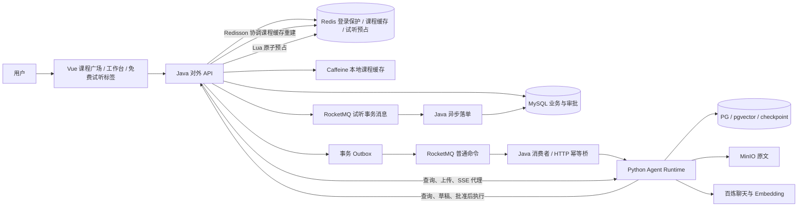
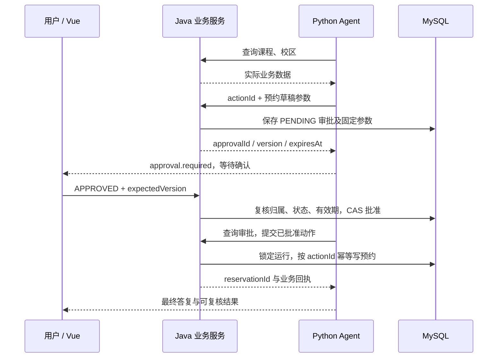

# 知课行 · AI 课程服务平台：产品功能说明书（研发版）

核对日期：2026-09-29 ｜ 读者：前端、Java 后端、Python/Agent 开发者、测试及接手维护人员。

历史验证（2026-09-26）：MySQL Flyway V1–V7 新库迁移、Java 单测、前端构建、隔离真实 Redis/RocketMQ 的 15+3 项测试和完整 Compose 的 Agent fixture 跨服务烟测通过。真实浏览器经 `8088/login` 完成注册、登录、首页、工作台及试听页面导航，控制台没有错误；直接抢课与 Agent 审批落单由 `Verify-Compose.ps1` 经同源入口验证。

最新验证（2026-09-29）：登录保护新增 22 项测试、课程目录新增 14 项测试通过，前端生产构建与 Agent 14 项 fixture/mock 回归通过。完整 Compose 已重建部署，17 个常驻服务运行正常；真实 8088 API 验证登录失败冷却、3 会话上限、课程接口与缓存命中，浏览器完成课程搜索、详情和咨询预填，直接抢课与 Agent 审批落单再次通过。当前使用 `fixture` 模型；详细环境与结果见[部署验证记录](../deployment/Docker部署验证记录.md)。外部模型、真实 API 的 MEMBER 浏览器权限、浏览器内 Agent 审批、会话淘汰后任务续跑、跨设备、网络故障和生产容量仍未验收。

本文说明三个项目组合后**现在能做什么、用户如何操作、系统如何协作、哪些结果才算完成**。内容来自当前源码及既有验证记录，不把改造方案中的未来目标写成现成功能。后续修改产品行为时，应同步更新本文、接口契约和前端类型。

本文使用三种能力标记：**页面可用**表示已有用户入口；**接口可用**表示后端已有能力但页面未提供完整入口；**待建设**表示当前没有形成可用闭环。其他页面与接口差异列在第 12 节。

阅读导航：

- [产品定位](#1-产品定位与范围) · [三项目协作](#2-三个项目如何组成产品) · [对象与权限](#3-业务对象与权限)
- [页面入口](#4-页面与功能入口) · [功能明细](#5-功能明细与业务规则) · [状态机](#6-状态机与前端交互约束)
- [SSE](#7-sse-与异步页面协议) · [接口索引](#8-研发接口索引) · [输入与预算](#9-输入与运行限制)
- [异常反馈](#10-异常如何反馈给用户) · [数据与运维](#11-数据持久化与运维边界)
- [差异与待建设项](#12-已知不一致与尚未提供的能力) · [验收清单](#13-接手联调的功能验收清单) · [代码定位](#14-代码定位与关联文档)

## 1. 产品定位与范围

知课行面向课程浏览与咨询、资料问答、预约意向登记和热门课程免费试听名额抢课。用户登录后可从产品首页进入课程广场筛选课程、查看详情，再带着课程信息进入 Agent 工作台。用户上传资料或选择知识库后，通过自然语言获取带证据的回答；业务操作可由 Agent 生成草稿、用户确认，再交给 Java 执行。工作台的“免费试听”标签支持 OWNER 运营与成员直接抢课。

主要使用场景：

1. **查资料**：从已上传的 PDF 等知识材料中查询事实，查看回答依据及原文页码。
2. **浏览与咨询课程**：在课程广场搜索、筛选、排序和分页，查看详情后进入 Agent 咨询课程与校区。
3. **登记预约意向**：生成草稿 → 用户批准 → 返回实际预约编号。
4. **抢免费试听名额**：在工作台“免费试听”标签查询详情并直接参与，或批准 Agent 草稿 → 查询持久请求终态；成功时取得 0 元试听订单号。
5. **追踪与恢复任务**：查看工具调用、等待补充或审批、取消任务、失败后按条件重试。
6. **维护知识与评测**：管理空间内的知识文档，执行规则评测，查看运行状态和模型用量。

普通“预约”是课程预约意向记录，不包含排课、时段选择或支付。“免费试听抢课”是独立的限量活动、参与请求和 0 元订单，包含库存预占与最终订单，不包含付款、退款或短信。运行 `SUCCEEDED` 不等于业务成功；普通预约核对 `EXECUTED` 审批及 `reservationId`，试听抢课必须核对参与请求 `SUCCEEDED` 且有真实 `orderId`。

## 2. 三个项目如何组成产品

| 项目 | Git 仓库 | 产品职责 | 持有的数据 |
|---|---|---|---|
| Java 业务后端 | [zhikexing-backend](https://gitee.com/chy66666/zhikexing-backend.git) | 账号与登录保护、课程目录、空间成员、审批、预约和试听事务、任务接收与投递 | MySQL 业务数据与 outbox；Redis 登录态、认证保护、试听预占；Caffeine + Redis 课程缓存 |
| Python Agent 服务 | [zhikexing-agent-runtime](https://gitee.com/chy66666/zhikexing-agent-runtime.git) | 模型调用、任务执行与恢复、消息和事件、知识处理与检索、评测 | PostgreSQL/pgvector、LangGraph checkpoint；文档对象 |
| Vue 工作台 | [zhikexing-web](https://gitee.com/chy66666/zhikexing-web.git) | 登录与资料、课程广场和详情、任务工作台、试听活动运营和直接抢课、审批卡、知识管理和评测展示 | 本地登录 Token、选中项和展示状态；业务事实由服务端持久化 |

建议克隆到任意父目录下的 `zhikexing-backend`、`zhikexing-agent-runtime`、`zhikexing-web` 三个同级目录。Compose 默认从 Java 仓库通过 `../zhikexing-agent-runtime`、`../zhikexing-web` 找到构建上下文；不同布局使用本地 `.env` 中的 `AGENT_RUNTIME_PATH`、`FRONTEND_PATH`，源码不依赖特定电脑的项目路径。三个项目副本的 Git `origin` 已配置为对应的知课行 Gitee 地址。



浏览器通过 Java 访问业务，不直接携带内部身份访问 Python。任务创建与取消走 outbox/RocketMQ，再由 Java 消费者通过内部 HTTP 交给 Python；会话查询、补充输入、重试、文档及评测等接口通过 Java 内部 HTTP 代理处理。试听事务消息走同一 Broker 的独立 Topic；不能假设所有请求都走消息队列。

百炼配置使用 `qwen3.7-flash` 和 `text-embedding-v4`，向量维度固定 1024，共用一把百炼 Key；2026-09-29 的完整 Compose 验收显式使用 `AI_PROVIDER=fixture`。内部服务 Token、数据库密码和观测凭据另行管理；“一个 API Key”指模型厂商凭据。

## 3. 业务对象与权限

### 3.1 开发者必须区分的对象

| 对象 | 含义 | 关键标识与规则 |
|---|---|---|
| 用户 | 登录后的业务主体 | 身份来自登录 Token，不能由请求体自行指定 |
| 课程 / 校区 | 全局展示目录中的业务对象 | ID 按字符串传输；课程价格为元、周期为天，校区目录不表示开班关系 |
| 工作空间 Workspace | 成员及共享知识的边界 | `workspaceId`；不是只用于前端筛选的标签 |
| 会话 Conversation | 某用户在某空间内的连续对话容器 | `conversationId`；会话属于创建者 |
| 运行 Run | 用户一次发送产生的一次可追踪执行 | `runId`；可含多次模型请求、工具、等待及恢复 |
| 消息 Message | 持久化的用户输入和最终助手回答 | 与会话、run 关联；完整历史不等于模型每次读取全部历史 |
| 事件 RunEvent | 执行过程的增量记录 | `(runId, seq)` 唯一；用于流式展示和断线重放 |
| 审批 Approval | 一份待用户确认的业务草稿 | `approvalId`、`version`、`expiresAt`；批准固定参数 |
| 动作 Action | 可恢复执行的某一次业务副作用 | `actionId`；同一运行内重放该动作返回同一结果 |
| 预约 Reservation | 已实际落库的预约意向记录 | `reservationId`；不能拿 runId 或 approvalId 冒充预约编号 |
| 试听活动 TrialCampaign | 有时间窗口、课程、校区和总名额的空间活动 | OWNER 创建、发布、暂停；发布后不能改窗口和名额 |
| 参与请求 TrialClaimRequest | 一次抢课的持久化受理与最终结果 | `requestId`；本人可查询最近 100 条记录；`PENDING/RESERVED` 均不是获得名额 |
| 试听订单 TrialOrder | 成功参与对应的 0 元业务结果 | `orderId`；以数据库提交后的请求 `SUCCEEDED` 判定 |
| 知识库 KnowledgeBase | 一个空间下的文档集合 | 可被选入某次运行的检索范围 |
| 文档 / 版本 / 片段 | 原始资料、一次入库版本及其检索单元 | `documentId`、版本号、`chunkId`；完整版本发布后才参与检索 |
| 评测 Evaluation | 一批知识问答样本的执行记录 | 保存逐例答案、证据、判定、延迟和用量 |

### 3.2 当前权限矩阵

当前仅实现 `OWNER` 和 `MEMBER`，没有 `ADMIN`、只读访客或审批专员角色。

| 能力 | 未登录 | MEMBER | OWNER |
|---|---|---|---|
| 注册、登录 | 可以 | 可以 | 可以 |
| 进入首页及工作台 | 不可以，前端跳登录 | 可以 | 可以 |
| 浏览课程广场、详情与全局校区目录 | 不可以 | 可以，无需指定空间 | 可以，无需指定空间 |
| 查看自己加入的空间 | 不可以 | 可以 | 可以 |
| 创建新空间 | 不可以 | 可以，创建后成为新空间 OWNER | 可以 |
| 查看该空间成员 | 不可以 | 可以 | 可以 |
| 将已有用户加入该空间 | 不可以 | 不可以 | 可以，仅接口入口 |
| 新建/读取自己的会话、运行和审批 | 不可以 | 可以 | 可以 |
| 查看或批准其他成员的运行审批 | 不可以 | 不可以 | 不可以 |
| 查看、创建知识库，上传、读取、重试、删除空间文档 | 不可以 | 可以 | 可以 |
| 新建与查看空间知识评测 | 不可以 | 可以 | 可以 |
| 查看运行指标 | 不可以 | 当前空间内本人的运行 | 当前空间内本人的运行 |
| 查询空间试听活动、参与抢课 | 不可以 | 可以；仅查看本人参与结果 | 可以；仅查看本人参与结果 |
| 创建、发布、暂停活动及查看对账 | 不可以 | 不可以 | 可以，在“免费试听”标签 |

知识库、文档和评测在空间内共享；会话、运行、审批和运行指标仍按用户隔离。空间 OWNER 不是能够查看所有成员私人会话的超级管理员。当前没有移除成员、变更角色、转让空间、删除空间的产品接口。

Java 检查登录与成员身份，Python 再按资源的空间和归属过滤。客户端伪造 `X-Actor-Id`、`X-Workspace-Id`、`X-Internal-Token` 或命令投递头，不会替代服务端的身份判断。

## 4. 页面与功能入口

| 页面 / 区域 | 能做什么 | 当前范围 |
|---|---|---|
| 登录、注册页 | 知课行品牌页展示课程服务场景；账号密码登录、注册、显示/隐藏密码，注册成功进入已登录状态；按 `Retry-After` 倒计时并暂停重复提交 | `/login`、`/register`；页面适配手机和深色主题，不提供短信/邮箱验证码或第三方 OAuth |
| 首页 / 用户区域 | 首页展示课程咨询、知识检索、Agent 审批、免费试听能力与流程；进入工作台、查看或修改昵称、切换主题、退出登录 | `/`；业务流程卡片是静态产品示意，不是实时会话、库存或审批数据 |
| 课程广场 | 按名称、方向和学历筛选，按价格或学习周期排序，分页浏览 | `/courses`；需登录，展示真实课程数据 |
| 课程详情 | 查看课程属性、价格与周期，进入 Agent 工作台预填咨询 | `/courses/:id`；用户点击发送后才创建会话和任务 |
| `/agent` 工作台左侧 | 切换空间、查看会话、开始新会话、选择已有运行 | 页面可用；不是团队所有成员的任务看板 |
| 工作台中间 | 选择 Agent/普通聊天、选择知识库、输入问题、查看历史与流式回答、打开引用 | 页面可用；活动运行期间锁定模式与知识库选择 |
| 工作台运行区域 | 状态、工具轨迹、模型用量、补充信息、取消/重试、审批与回执 | 页面可用，按钮与后端约束的不一致见第 12 节 |
| 工作台试听审批卡 | 展示 `claim_trial` 固定活动参数并批准或拒绝 | 页面可用；审批提交与订单确认分别展示 |
| 工作台“免费试听”标签 | 浏览活动列表与详情、直接抢课、查看本人的持久参与记录并按请求编号追踪结果；OWNER 选择课程与校区、创建/发布/暂停活动、查看对账 | `/agent` 内；按空间与角色显示操作 |
| 知识管理面板 | 创建知识库、选择库、上传 PDF、观察处理状态、查看片段/原文、重试失败处理、删除文档 | 页面当前仅 PDF；后端支持范围更广 |
| 评测面板 | 输入问题和可选断言、提交评测、查看逐例结果与汇总 | 页面可用；不是模型训练或自动调参平台 |

界面没有完整的空间成员管理、同文档版本升级/回滚、课程管理、校区管理、全空间审批中心或模型参数配置页。试听页面只查看本人的参与记录与结果，不提供跨成员的订单管理或支付后台。

## 5. 功能明细与业务规则

### F01 账号与登录态

**目的**：以稳定用户身份访问工作空间和自己的任务。

用户通过已有 `/user` 接口注册或登录。前端保存登录 Token，后续请求放入 `Authorization` 头；这里沿用现有 Token 协议，不额外拼接 `Bearer`。接口返回 401 时，前端清除本地 Token 并返回登录页。

登录凭证是 Redis 随机 Token，不是 JWT。Java 同时兼容原始 Token 与 `Bearer token`，前端当前发送原始 Token。用户名去首尾空白后非空、最长 11 字符；密码非空且 UTF-8 最长 72 字节；昵称非空、最长 20 字符。顶栏提供修改昵称、明暗主题及退出登录。登录态访问时续期，默认有效期 1440 分钟；退出仅删除当前 Token，不代表所有设备下线。

登录与注册在 BCrypt 校验或哈希前共享 Redis 固定窗口限流，默认每秒 20 次；同一个 Java 实例用 `Semaphore` 同时处理最多 4 个认证请求，旧密码升级也在该并发额度内。登录查到用户后按 `user.id` 限制每账号每分钟最多 10 次尝试；10 分钟内密码错误 5 次后冷却 60 秒，冷却期间拒绝请求不延长时间。成功登录清除失败计数，保留频率额度。

每账号最多保留 3 个登录会话，超限淘汰最早创建的会话；有效请求续期 24 小时，续期不改变淘汰顺序。限流/冷却返回 429，并发满或依赖不可用返回 503，均带 `Retry-After`。前端读取秒数并显示倒计时，等待期间禁用按钮且拦截重复提交，到期恢复；Java CORS 暴露该响应头。会话键升级为 `login:v2:token:` / `login:v2:sessions:`，原 Token 失效，需要重新登录。详细配置与测试见[登录保护](../modules/登录保护.md)。

注册成功即可取得 Token。确认密码属于前端校验，不是后端请求中的独立业务字段。当前没有找回密码、验证码登录、强制多因素认证、用户注销账户功能闭环。

退出、会话过期、会话被淘汰或关闭页面都不取消已接受的 Agent 运行。Runtime 使用内部 `AGENT_INTERNAL_TOKEN` 和已持久化的用户、工作空间身份；重新登录后可查看结果或继续审批，需要取消任务时使用明确的取消接口。

### F02 工作空间与成员

**目的**：隔离不同成员集合的共享知识资源。

首次获取空间列表会为用户建立个人空间（如尚不存在）。每个空间具有名称及当前用户角色。用户选择空间后，界面重新加载该空间可见的会话、运行、知识和评测数据，不复用另一空间的引用或审批卡。

创建/切换空间有页面入口，创建弹窗当前限制名称最多 80 字符，Java 接口上限为 120。成员查看/添加只有 API：OWNER 提交已注册账号的 `userName` 将其加入为 MEMBER，重复添加视为成功；这不是发送邀请邮件。成员管理没有当前可用页面入口。

### F03 会话与消息历史

**目的**：围绕一个主题持续交流，同时保留每次执行的事实。

- 点击“新会话”先清除本地选中项；第一次发送时才创建服务端会话，页面默认使用输入前 40 个字符作为标题。
- 同一会话可包含多个顺序执行的 run；当前会话已有活动运行时，不允许另起并行运行。
- 活动状态包括 `QUEUED`、`RUNNING`、`WAITING_INPUT`、`WAITING_APPROVAL`。等待用户操作也占用该会话的活动位置。
- 完整历史保存用户输入、补充输入、最终助手消息及引用；工具过程在事件与 checkpoint 中，不能假设会话消息数组包含全部工具日志。
- 模型新运行使用最近 20 条消息，每条最多 8000 字符；失效知识引用对应的历史回答不会继续注入上下文。当前没有长期偏好、结构化记忆或摘要管理页面。很久以前的条件可能不在本次模型上下文中，应允许用户重新说明。
- 切换会话、离开页面仅断开当前 SSE 订阅，后台任务继续；回到会话后从持久化记录恢复展示。

当前没有会话重命名、删除、分享或协同编辑接口。

### F04 普通聊天与 Agent 模式

| 模式 | 模型可做什么 | 知识库选择的意义 |
|---|---|---|
| `chat` 普通聊天 | 直接使用聊天模型回答，仍有 run、消息、usage 和 SSE | 不向模型开放检索工具；选择知识库不会自动注入资料 |
| `agent` Agent | 模型按需调用课程、校区、知识查询、草稿和追问工具，直到结束或等待 | 限制 `search_knowledge` 的检索范围；不保证模型每次都会调用检索 |

当前模型可选择 `search_courses`、`list_campuses`、`search_knowledge`、`draft_reservation`、`ask_user`，以及试听用的 `query_trial_campaigns`、`draft_trial_claim`、`query_trial_claim`。`draft_trial_claim` 只创建待批准草稿，不能自动占名额。没有开放任意网页浏览、用户指定 URL 的 MCP、代码执行或自由 SQL。

工具事实与模型生成内容要分开显示。模型说明“预约成功”不构成业务回执；模型自然语言说“第 2 页”也不等同于已经产生结构化证据引用。

### F05 发送任务、观察执行与重复请求

**前置条件**：已登录、属于当前空间、会话归属正确，选中的知识库属于该空间。

1. Vue 生成 `clientRequestId` 并提交问题、模式及知识库 ID。
2. Java 校验资源，将任务接收记录和 outbox 在一个 MySQL 事务内保存，返回 `runId`。
3. Relay 投递 RocketMQ 普通命令；Java 消费者经内部 HTTP 交给 Python，Python 持久化 run 后返回 2xx，Java 才确认消息，随后 Python 在后台执行图。
4. Vue 查询运行详情，订阅事件，逐步显示回答、工具结果、等待状态与最终结果。

同一用户与空间内，同一 `clientRequestId`、同一规范化请求内容返回同一运行；同键不同内容返回 409。用户主动再次问一个问题应生成新请求键；网络超时重发同一次提交应复用原键。这个规则不能替代预约动作的 `actionId` 幂等。

Java 已接受而 Python 尚未建立 run 时，详情返回 `execution:null` 和 `submission` 信息，通常仍显示 `QUEUED`。页面此时短轮询等待，不将暂时不存在的执行记录当作永久丢失，也不将 `DELIVERED` 显示为回答完成。

Java 公开提交接口当前返回 HTTP 200 和 `status:QUEUED`，Python 内部接收接口才使用 202。Java 对同请求键的重放也返回接收回包中的 QUEUED，不能据此把已完成运行改回排队；最新状态必须 GET 详情。前端对网络响应丢失的请求键复用仅保存在当前页面内存，刷新页面后不承诺仍能自动找回该提交键。

若已接受命令在消费时遇到会话占用等业务冲突，Python 会保存可查询的失败运行与错误事件。失败请求的输入不会抢先污染另一个活动运行的模型上下文；获准重试后才加入消息历史。

### F06 补充信息、取消与重试

**补充信息**：模型缺少必需条件时可调用 `ask_user`；当前图 v4 对重复相同空查询也会请求补充。运行进入 `WAITING_INPUT`，页面显示问题，用户在同一 run 提交补充内容和新的 `clientRequestId`。同一补充请求重复提交不重复归档；同键不同内容或前一条仍待消费时返回冲突。

**取消**：Java 先持久化该运行的禁止写入标记，将尚未执行的 PENDING/APPROVED 审批改为 CANCELLED，再可靠通知 Python。Java 即时回包里的 CANCELLED 表示取消受理和业务写禁令；前端还要通过运行详情/SSE 确认 Python 终态，不能仅凭按钮请求成功就认定模型与所有网络请求已瞬时停止。重复取消不会不断生成新取消命令。

取消只阻止之后的写入。如果预约事务或试听参与请求已先获受理，取消不撤销已有预约，也不回滚已经提交的试听请求或订单。处理“已执行业务，但最终回答失败/取消”的情况时，应按 actionId 查看原业务结果。

**重试**：只允许 `FAILED` 或 `TIMED_OUT`，且原运行预算未耗尽、所属会话没有其他活动任务、资源及运行版本仍可用。重试继续原 run，不清空已耗 Token/费用，也不重新执行已经成功的业务动作。`CANCELLED` 不允许通过 retry 恢复；用户确实要重新办理时应提交一个新的运行。

`WAITING_APPROVAL` 不接受普通补充输入来偷偷修改草稿。修改预约信息应先拒绝当前草稿、等待原运行结束，再重新发起。

### F07 课程广场、详情与校区咨询

课程广场与 Agent 共用 Java 的 `CourseCatalogService`，查询现有课程和校区。课程字段为 `id/name/type/edu/price/duration`，校区字段为 `id/name/city`，ID 均按字符串传输。

支持课程关键词、类型、学历条件，以及 `price/duration/id` 白名单排序。课程名和查询词去除空白后匹配，返回时保留原始显示名，因此“Python与AI应用演示课程”能匹配带空格的演示名称。

类型按精确值匹配；学历按“课程要求 ≤ 用户提供条件”筛选，枚举为 0 无、1 初中、2 高中、3 大专、4 本科以上。浏览器课程 API 返回 `{items,total,page,pageSize}`，默认每页 12 条、最多 50 条；Agent 内部工具保持最多 50 条的数组，不提供分页。浏览器校区 API 最多返回 200 条，Agent 工具最多 100 条。当前没有城市查询参数、价格区间过滤或课程与校区开班关联查询。

`duration` 为学习天数，`price` 为人民币元（整数），不除以 100。2026-09-29 的课程广场增量统一了 Java 字段说明、Agent 工具描述和前端展示；现有数值不做换算，例如演示数据 `3999` 展示为 `¥3,999`。课程价格仅用于展示，免费试听的 `amountCent=0` 仍遵循独立订单契约。

`/courses` 与 `/courses/:id` 提供课程筛选、分页与详情。咨询按钮携带课程名和字符串 ID 进入 `/agent` 并预填问题；预填只修改页面草稿，用户发送后才创建服务端会话和运行。课程不存在显示 404，列表加载失败可重试原页码。

Java 的默认首页、Agent 默认列表、试听创建选项、校区目录和课程详情使用 Caffeine + Redis 两级缓存。Caffeine 合并本机同键加载，Redisson 锁在 Redis 未命中后协调跨实例重建，并在获得锁后再次检查缓存；自由筛选、非默认排序和其他分页直接查询 MySQL。默认本地缓存 10 秒、Redis 60 秒，课程更新允许约 70 秒加查询耗时的展示延迟；Agent 的单 run 缓存还可能叠加延迟。鉴权在缓存读取前执行，试听库存、审批和登录会话不进入展示缓存，详见[课程目录与两级缓存](../modules/课程目录与两级缓存.md)。

同一 run 内相同的只读工具查询可缓存 30 秒；事件标识 `cached`。重复空结果转补充信息，避免无收益地反复查询。缓存不用于草稿或预约提交，知识证据复用前仍重新校验可见性。

### F08 预约草稿、审批与回执

**必需数据**：实际课程 ID、实际校区 ID、学生姓名、联系方式；备注可选。课程和校区必须能从业务库查回，不能仅凭模型编造名称办理。

课程/校区 ID 为数字字符串，姓名最长 64 字符、联系方式最长 128、备注最长 500。联系方式目前只校验非空和长度，不校验真实手机号/邮箱，也不发送验证信息。系统校验两条业务记录存在，但没有校验该课程是否在所选校区实际开班。



审批卡展示固定的课程、校区、姓名、联系方式、备注、状态与有效期。默认有效期 15 分钟，初始 version=1。批准或拒绝必须携带读取时的正整数 `expectedVersion`，重复点击或旧版本请求不会静默覆盖新状态。已批准但尚未执行的草稿仍受该有效期限制，批准不延长期限。

运行时在等待审批期间暂停，checkpoint 可跨进程重启保留。用户批准后，Python 再调用专用执行接口；Java 使用已保存、已批准的参数，独立复核审批与运行取消标记。模型不能通过新参数绕开用户批准内容。

同一 `(runId, actionId)` 再次执行时返回已有结果；提交响应丢失或图恢复时先查结果。草稿本身也幂等。此能力保证已识别动作的重复处理不会产生第二笔预约，不代表“任意相同姓名与课程只能预约一次”。用户新建 run 仍可能形成新的业务动作。

**完成判据**：审批为 `EXECUTED`，回执存在实际 `reservationId`。`PENDING`、`APPROVED`、队列 ACK、run 接收成功都不等于预约已经落库。

### F08a 免费试听名额秒杀与 Agent 联动

**活动管理（页面可用）**：空间 OWNER 在 `/agent`“免费试听”标签通过课程与校区目录选择真实业务对象，创建活动、设定开放窗口与总名额，发布后可暂停并查看只读对账；普通成员可在同一标签查询列表与详情、参与活动，且只能读取本人的参与结果。活动一经发布不再编辑课程、窗口或名额。

**直接参与**：成员在“免费试听”标签提交参与；页面为同一次操作保持稳定 `clientRequestId`。Java 先持久化参与请求并返回 HTTP 202 和 `requestId`，此时不是成功。RocketMQ 事务消息本地回调用 Redis Lua 原子检查窗口、同用户参与和余量，预占成功后提交消息；消费者异步在 MySQL 事务中条件扣库存并创建唯一的 0 元订单。页面列出本人最近 100 条持久参与记录，也可按原 `requestId` 查询处理中和终态结果，刷新页面或换设备后仍能恢复。相同请求重放返回原回执，每人每活动仅能参与一次。直接参与和 Agent 共用同一用户限流与业务规则。

**Agent 参与**：模型用 `query_trial_campaigns` 查询活动，用 `draft_trial_claim` 生成绑定活动与当前用户的审批草稿；人批准 `claim_trial` 后，Agent 用固定 `actionId` 调用 Java 工具提交参与，再以 `query_trial_claim` 回查。审批 `EXECUTED` 仅表示提交动作已有业务回执，`PENDING/RESERVED` 仍是处理中。只有参与请求 `SUCCEEDED` 且返回真实 `orderId` 才表示获得资格；图仅有限次轮询，不应把超时推断为失败或成功。后续运行可用同一身份查询原动作。

**边界**：总名额 1–10000，活动窗口最长 30 天；参与受每用户每秒最多 5 个新请求的限流约束。系统不承诺严格先到先得；页面展示的数据库剩余量不是实时可抢名额。Redis 状态丢失时停止受理并对账，不自动重建库存。模块完整状态、异常恢复和验证条件见[专项设计](../modules/免费试听秒杀与Agent联动.md)与[验证记录](../modules/免费试听秒杀验证记录.md)。

### F09 知识库、上传与异步入库

**目的**：把空间共享文档转为可授权检索的资料，而不是将一个 PDF 永久绑定到一个聊天。

用户先创建或选择知识库，上传后立即获得文档记录，后续异步解析、切块和生成向量。对象存储完成不等于资料已可检索；新文档只有完整版本发布为 READY 后才参与召回。

当前后端接受 PDF、UTF-8 TXT、Markdown，单文件非空且不超过 20 MiB（界面文案通常写 MB，实际为 20×1024×1024 字节）；PDF 校验文件头，有文本 PDF 最多 300 页。默认 `pypdf` 不构成扫描件 OCR 能力。无法抽取有效文本或超过处理上限会记录失败原因，不能伪装为成功入库。

当前页面只提供 PDF 上传并显示不一致的 50 MB 提示，详见第 12 节。上传时显示文件名和忙碌状态，没有百分比进度条；解析和向量化另看服务端状态，不能将上传结束表示为 READY。当前不是批量上传或拖放上传界面。

同一空间、同一知识库下重复上传相同 SHA256 内容，会返回已有文档；这与文件名相同不同，不应将“换文件名”作为绕过去重的新版本方案。

默认片段长度约 800 字符、重叠 100 字符，片段数有上限；使用 `text-embedding-v4` 生成 1024 维向量。文本切分和模型调用参数属于研发配置，不向用户展示为可随意调节的产品开关。

### F10 文档版本、预览、失败重试与删除

**版本更新（接口可用）**：向上传接口额外传入 `documentId`，在同一文档下形成新 pendingVersion；已有版本正在处理时不能并发覆盖。只有新版本完整成功后才切换 activeVersion。更新失败保留旧的可用版本，不能因为一次失败上传就让已有知识消失。

当前没有历史版本列表、版本选择、回滚接口或对应界面；“有版本字段”不能写成“有完整版本管理后台”。页面一般通过上传创建新文档，未提供对已有 documentId 替换版本的操作。

**原文与片段**：原文经 Java → Python 授权接口返回，前端取得 Blob 后打开预览；PDF 引用携带页码，可打开对应页并查看片段。`/content` 优先读 activeVersion，尚无激活版本时可返回 pending 原文件；`/chunks` 只读 activeVersion，因此“能预览原文件”不等于“已可检索”。不能把 MinIO 私有对象地址直接当作无需鉴权的公开链接。

**重试**：仅处理失败的文档可重试，继续处理保存的版本对象；该动作不同于重新选择一个文件上传。

**删除**：先标记删除并撤销列表、下载、片段与检索可见性，删除切块记录，再由后台清理全部版本的对象数据，处理状态由 DELETING 到 DELETED。元数据保留，当前没有可恢复回收站。删除接口返回后，不承诺物理存储已立即释放。既有对话文本不会因此自动消失；历史引用的原文可能变为不可访问。

当前引用预览接口没有指定历史版本的参数，不能承诺更新文档后仍自动打开回答当时的旧版原文。需要审计级历史证据还原时，应另补版本绑定的下载契约。

### F11 知识检索、引用与回答

检索范围由可信工作空间和 run 选择的知识库决定。召回只使用未删除文档的可用版本，融合 pgvector 向量排名和中文词项排名，再通过 RRF 合并。当前词法是词项重叠排名，不是已部署 Elasticsearch/BM25。

默认 dense 与 lexical 各取前 20 个候选，融合后返回前 5 个；证据含文档、版本、片段、页码及内容。运行中知识被更新或删除、导致已有证据失效时，可能返回 `KNOWLEDGE_CHANGED`，应基于最新资料重新发起任务，不能继续展示旧证据为当前有效事实。

Agent 回答通过 `[E1]` 等证据编号与检索结果建立关联。图校验编号是否存在；已有证据但最终答复缺少编号，或使用了不存在的编号时，允许一次有预算限制的引用修正。修正前发送 `message.reset`，前端清除本 run 的旧流式草稿。仍无效则返回 `INVALID_CITATIONS`，不能把所有召回文档冒充答案实际引用。

引用编号有效仅说明引用指向存在的证据，不等于已经自动证明每一句回答都受到证据支持。没有依据时的准确拒答、冲突资料理解及语义忠实性仍需评测和人工复核。

### F12 知识问答评测

**目的**：帮助开发者查看固定问题的回答、召回证据和基础规则是否符合预期。

每批选择一个知识库，API 允许提交 1–100 条案例，当前页面最多添加 50 题。每条包含问题 `question`，可选 `expectedText` 和 `expectedDocumentId`。系统按案例执行“检索 + 模型回答”，保存逐例结果，页面可查看进行中的部分结果；服务重启后可继续未完成案例。

| 判定项 | 实际含义 |
|---|---|
| `expectedText` | 回答原样包含指定字符串，大小写敏感；不是语义相似度或 LLM 裁判 |
| `expectedDocumentId` | 召回证据中包含该文档；不是严格的答案引用支持率 |
| 同时填写两者 | 两个条件同时满足才算通过 |
| 两者都不填 | 正常完成的样本 `passed:null`，显示未评分 |
| 案例执行异常 | 保存错误，记为失败；不因没有参考断言而忽略执行异常 |
| 批次 `SUCCEEDED` | 所有案例执行完毕；不表示所有案例均通过 |

`passRate = passed / scored`，没有可评分案例时为 null。`total` 在进行中表示当前已保存的结果条数；不应将它永远解释为提交时的样本总数。

评测结果中的 `citations` 当前是全部召回证据，不经过 Agent 最终答复的引用筛选与修正，语义与普通运行的最终 `citations` 不完全相同。评测不会执行完整预约工具链，不能拿知识问答通过率代表 Agent 业务成功率。

当前没有评测取消、失败批次一键重试、数据集版本管理、人工标注流、A/B 对照管理、自动训练或自动优化提示词的闭环。想重新评测应提交新批次。

### F13 用量、状态指标与运维观测

运行详情保存模型、输入/输出/总 Token、已知的聊天估算费用及执行配置快照。厂商没有返回 usage 时按未知处理；估算使用代码中的价格快照，不是厂商账单，也不包含所有 Embedding 和评测费用。

`GET /api/v1/metrics` 的范围是**当前用户在当前空间的所有 run**，不是团队总量：

| 字段 | 当前计算口径 |
|---|---|
| `runCount` | 该用户、该空间的运行数量 |
| `successRate` | SUCCEEDED 数量 / 全部运行数量；分母包含活动、等待、失败与取消运行 |
| `totalTokens` | 已有 totalTokens 的加总；未知值没有被补成实测用量 |
| `estimatedCostCny` | 全部 run 都有已知估算时才返回总额，否则为 null |
| `knownCostCny` / `unknownUsageRuns` | 已知部分估算与费用未知的运行数 |
| `averageLatencyMs` | 保存的 latency_ms 在全部 run 上的平均；不是包含完整排队与审批等待的端到端 SLA |
| `statusCounts` | 按当前状态分组计数 |

Langfuse、Prometheus、Grafana 和 OTel 属于开发运维入口。当前模型观测记录元数据与 usage，不保存提示词和回答正文。它们不能替代产品内的消息历史、业务回执或正式账单。

## 6. 状态机与前端交互约束

### 6.1 运行状态

| 状态 | 用户看到的含义 | 可用操作 / 转移 |
|---|---|---|
| QUEUED | 已接收、等待投递或执行 | 查询、取消；可能尚无 Python execution |
| RUNNING | 正在执行模型或工具 | 看事件、取消；不能对同会话另开活动 run |
| WAITING_INPUT | 等待补充必要信息 | inputs 恢复同一 run；后端允许取消，现有页面缺该状态取消按钮 |
| WAITING_APPROVAL | 有待确认业务草稿 | 批准/拒绝或取消；不允许通过 inputs 修改草稿 |
| SUCCEEDED | 本次运行正常结束 | 查看历史与结果；业务成功仍须核对预约回执或试听订单 |
| FAILED | 明确执行失败 | 查看 error；满足资源、预算、版本和会话约束时重试 |
| TIMED_OUT | 执行超时 | 按 FAILED 类似条件处理，重试不重置累计预算 |
| CANCELLED | 运行已取消 | 查看已有结果；禁止 retry，不能据此撤销已提交预约 |

一般主线为 `QUEUED → RUNNING → SUCCEEDED`；执行中可进入输入/审批等待，再恢复执行。非终态可能取消或失败。等待状态不是执行完成，最终完成事件必须持久化后才能作为收尾依据。

### 6.2 审批状态

| 状态 | 含义 | 规则 |
|---|---|---|
| PENDING | 草稿已创建，尚未决定 | 未过期、未取消、版本相符时可批准或拒绝 |
| APPROVED | 用户同意固定参数 | 等待运行时执行，不代表已预约 |
| REJECTED | 用户拒绝 | 不执行业务写入，Agent 可继续给出说明 |
| EXPIRED | PENDING 或 APPROVED 草稿已过有效期 | 根据读取时刻计算的视图状态，不代表定时任务改表；旧审批不能提交 |
| CANCELLED | 所属运行取消使未执行审批失效 | 不能批准或提交；不改变此前 EXECUTED 的实际结果 |
| EXECUTED | 已完成业务动作 | 读取实际回执；重复恢复查询同一结果 |

审批是 Java 业务事实，运行状态是 Python 执行事实，二者不应互相覆盖。例如业务 EXECUTED 后模型回答失败，不能将已存在预约或试听参与请求改成未执行。对 `claim_trial` 而言，EXECUTED 仅表示参与请求已提交；订单成功以参与请求的最终状态和 orderId 为准。

### 6.3 试听参与请求状态

`PENDING` 为已受理，`RESERVED` 为 Redis 已预占但订单未提交，`SUCCEEDED` 且有 `orderId` 才是 0 元订单已落库，`REJECTED` 为最终未获资格。`PENDING/RESERVED` 期间应使用原 `requestId` 查询，不创建新请求来探测结果。

### 6.4 文档与评测状态

文档实际写入状态为 `UPLOADED → PARSING → EMBEDDING → READY`，失败则保留 `FAILED` 与错误。`INDEXING` 当前仅在恢复调度扫描和兼容标签中出现，没有独立写入该阶段。处理的是 pendingVersion，检索使用 activeVersion，两者不能混为一谈。

文档删除后不再作为普通可见记录展示。评测主线为 `QUEUED → RUNNING → SUCCEEDED`，每条案例可独立失败；批次完成和规则全部通过是两个指标。

## 7. SSE 与异步页面协议

事件入口为 `GET /api/v1/runs/{id}/events?workspaceId=...&after=...`。前端使用支持 Authorization 的流式请求，不依赖无法设置该头的原生 EventSource 默认行为。

```text
id: 12
event: tool.completed
data: {"runId":"<runId>","seq":12,"type":"tool.completed","data":{...},"createdAt":"<time>"}
```

| 事件 | 页面处理 |
|---|---|
| run.started / step.started | 更新执行阶段与轨迹 |
| tool.started / tool.completed | 显示工具名、展示用参数和结果；错误结果不能显示成业务办理成功 |
| message.delta | 追加该 run 的流式回答草稿 |
| message.reset | 仅清除该 run 旧回答草稿，保留用户消息和工具轨迹 |
| input.required | 显示补充问题并等待输入 |
| approval.required | 加载实际审批对象并显示确认卡 |
| usage.updated | 更新已知用量和费用展示 |
| message.completed | 使用持久化最终消息收敛页面结果 |
| run.completed / run.failed / run.cancelled | 更新终态，停止该运行的事件追踪 |

`seq` 在单个 run 内单调增加，客户端去重并保存已消费游标；重连支持 `after` 与 `Last-Event-ID`。切换会话要释放旧连接并隔离 run 状态，不能把旧流写入新会话。终态事件和最终消息按实际持久化数据读取，刷新后不依赖浏览器内存才能显示。

前端断线自动重连最多 5 次，采用递增退避、单次等待最多 15 秒；401/403/404 不继续自动重试，页面提供手动重连。服务端约每 10 秒发送心跳。提交尚未建立 execution 时采用约 2 秒的详情轮询。

当前没有事件保留期清理及“游标过旧”的完整快照重置产品协议。使用方不要假设已经具备无限规模的事件归档策略。执行轨迹展示可复核的动作和结果，不包含模型隐藏思维链。

## 8. 研发接口索引

课程、Agent 与试听 API 返回直接 JSON，错误通常为 `{code,message}`；参数校验还可能附带字段信息。`/user` 等账号接口使用 `{ok,msg,data}`。不要让一个通用解析器把两套格式混淆。业务 ID 在前端按字符串管理，课程与校区 ID 也保持字符串。

账号入口为 `POST /user/register`、`POST /user/login`（`userName,password`），`GET /user/me`、`POST /user/nickname`（`nickname`）及 `POST /user/logout`。账号业务失败可能仍返回 HTTP 200，必须检查 `ok`；新 Agent API 不使用这个成功标记。

登录/注册保护拒绝保留 `{ok,msg,data}` 格式：频率超限或失败冷却返回 HTTP 429，`Retry-After` 为剩余秒数；本机认证并发满、Redis/数据库不可用返回 HTTP 503，`Retry-After: 1`。密码错误仍返回 HTTP 200、`ok: 0`。前端按状态和响应体显示错误，带等待时间时启动倒计时。

下表路径均为 Java 对外入口，除账号接口外省略前缀 `/api/v1`。课程与全局校区浏览只需登录，无需 `workspaceId`；空间资源按接口契约携带空间参数，上传使用 multipart。

| 功能 | 接口 | 关键说明 |
|---|---|---|
| 课程浏览 | GET `/courses`、`/courses/{id}` | 登录后可读；列表参数为 `keyword,type,edu,sortBy,ascending,page,pageSize`，详情不存在返回 404 |
| 校区目录 | GET `/campuses` | 登录后可读；全局目录最多 200 条，不表示课程开班关系 |
| 空间 | GET、POST `/workspaces` | 列出已加入空间 / 创建空间 |
| 成员 | GET、POST `/workspaces/{id}/members` | 查看成员 / OWNER 提交 `{userName}` 添加已注册用户 |
| 会话 | GET、POST `/conversations`；GET `/conversations/{id}` | 列表、创建、完整消息；无编辑删除 |
| 提交任务 | POST `/runs` | `workspaceId,conversationId,clientRequestId,input,knowledgeBaseIds?,mode?` |
| 查询任务 | GET `/runs`、`/runs/{id}` | 运行事实或 submission 交接信息 |
| 流式过程 | GET `/runs/{id}/events` | SSE，after / Last-Event-ID |
| 运行控制 | POST `/runs/{id}/cancel`、`/retry`、`/inputs` | inputs 必须携带补充请求键；重试遵守状态和预算 |
| 审批 | GET `/approvals`；POST `/approvals/{id}/decision` | decision 为 APPROVED / REJECTED，附 expectedVersion |
| 试听目录 | GET `/workspaces/{workspace}/trials/catalog` | 成员可读；最多返回 500 门课程、200 个校区，OWNER 创建页下拉选择 |
| 试听活动 | GET、POST `/workspaces/{workspace}/trials/campaigns`；GET `/workspaces/{workspace}/trials/campaigns/{id}` | OWNER 创建；成员查询 |
| 活动操作 | POST `/workspaces/{workspace}/trials/campaigns/{id}/publish`、`/pause`；GET `/workspaces/{workspace}/trials/campaigns/{id}/reconciliation` | OWNER 发布、暂停、只读对账 |
| 参与与结果 | POST `/workspaces/{workspace}/trials/campaigns/{id}/claims`；GET `/workspaces/{workspace}/trials/claims`、`/claims/{requestId}` | POST 202 是受理；仅本人可查最近 100 条记录和单条请求，成功须有 orderId |
| 知识库 | GET、POST `/knowledge-bases` | 列表与创建；无重命名删除 |
| 文档 | GET、POST `/documents` | 上传字段 workspaceId / knowledgeBaseId / file；可选 documentId 更新版本 |
| 文档处理 | POST `/documents/{id}/retry`；DELETE `/documents/{id}` | 失败重试 / 撤销可见性并异步清理 |
| 文档读取 | GET `/documents/{id}/content`、`/chunks` | 授权原文 / 片段 |
| 评测 | GET、POST `/evaluations`；GET `/evaluations/{id}` | 新批次、列表、逐例结果 |
| 指标 | GET `/metrics` | 本人在当前空间的运行汇总 |

Java → Python 使用 `/internal/v1` 和可信内部身份。Python → Java 的业务工具使用 `/internal/v1/tools`，额外携带当前 run：课程、校区、试听活动查询、两类草稿、审批查询、批准后执行、按 actionId 查询结果。模型不能直接选择执行预约或未经批准的试听参与接口。

`runId`、`conversationId` 或 MCP session ID 都不是访问凭据。遇到 404 应允许“资源不存在或无权访问”的合并语义，不根据该响应向用户泄露另一空间的数据是否存在。

完整字段及三方协作约定参见 [研发接口契约](../upgrade-plan/研发接口契约.md)。当前应用还没有一份跨 Java/Python、自动生成并保持同步的完整 OpenAPI 客户端。

## 9. 输入与运行限制

下表是代码默认值，不是承诺达到的性能指标。环境配置可以覆盖明确开放的运行参数。

| 项目 | 当前限制 / 默认值 | 产品含义 |
|---|---|---|
| 登录与注册全局限流 | Redis 固定窗口 20 次/1 秒，两接口共用 | BCrypt 前拒绝超额请求，多实例共享额度 |
| 认证并发 | 每个 Java 实例最多 4 个请求 | 登录、注册和旧密码升级共用 `Semaphore`，并发满立即返回 503 |
| 账号登录限流 | 按 `user.id` 固定窗口 10 次/60 秒 | 查到用户后、BCrypt 校验前检查；成功登录不清频率额度 |
| 密码失败冷却 | 首次失败起 600 秒内达到 5 次，冷却 60 秒 | 触发后清本轮失败计数，拒绝请求不延长冷却，成功清失败计数 |
| 登录会话 | 每账号最多 3 个；24 小时滑动过期 | 超限淘汰最早创建会话；有效请求续期，不改变创建顺序 |
| 课程分页 | 默认每页 12 条，最多 50 条 | 任意筛选及其他分页直接查询 MySQL |
| 课程展示缓存 | 本地 10 秒、最多 1000 条；Redis 60 秒；锁等待 1 秒 | 低频更新目录采用 TTL 刷新，锁等待超时返回 503 |
| 运行输入、补充输入 | 每条最多 12000 字符 | 超长输入应在 UI 与 API 一致校验 |
| 会话标题、知识库名称 | 最多 160 字符 | 新会话页面标题默认取输入前 40 字 |
| 单次选择知识库 | 最多 20 个 | 范围仍需逐项授权 |
| 上传文件 | 后端 20 MB，非空；PDF/TXT/Markdown | 页面 PDF/50 MB 差异需要修正 |
| PDF 页数 / 入库片段 | 最多 300 页 / 1500 片段 | 超限明确失败，不能悄悄截断后声称完整入库 |
| 单个评测批次 | 1–100 条；问题最长 4000 字符 | 300 条正式数据集需要分批与版本管理，目前未建立 |
| 审批有效期 | 15 分钟 | 过期草稿不能直接提交 |
| 运行图步骤 / 工具预算 | 默认 12 / 8 | 防止无限工具循环；预算不足应明确结束 |
| 累计 Token / 费用检查 | 默认 40000 Token / 0.10 元 | 调用前检查已知累计用量；不是厂商硬限额，重试不清零 |
| 执行超时 | 默认每次图执行/恢复片段 240 秒 | 人工等待不计入；不是从提交到终态的总时限 |
| 后台作业并发数 | 默认共享额度 4；单 worker | run、入库、评测、对象清理共同竞争；不是 4 个 Agent 外加无限其他作业 |
| Agent 只读工具结果缓存 | 单 run 内 30 秒 | 与 Java 课程展示缓存分开；不跨用户、空间或 run 共享，不缓存写入 |
| 试听活动 | 1–10000 名额，窗口最长 30 天 | 发布后不编辑；不承诺严格先到先得 |
| 本人参与记录 | 最近 100 条 | 超出列表范围仍可凭 `requestId` 查询单条结果 |
| 试听参与限流 | 每用户每秒最多 5 个新请求 | 直接与 Agent 调用共用；同请求重放查询原回执 |

费用预算不能完整覆盖缺失 usage 的请求，也不等于 Embedding、评测和整个平台的总预算。评测链路与 Agent 图不同，不能假设它自动继承 run 的全部步骤、费用、超时和引用修正规则。

## 10. 异常如何反馈给用户

| 情况 | 研发处理要求 | 当前依据 |
|---|---|---|
| 未登录、会话过期或被淘汰 | 收到 401 清除本地 Token 并返回登录页，已提交 Agent 任务继续运行 | 认证接口、工作台请求封装与 Runtime 内部任务身份 |
| 登录频率超限或密码失败冷却 | 显示服务端提示，按 `Retry-After` 倒计时并阻止重复提交，到期恢复 | HTTP 429；Redis 限流、失败计数与冷却 |
| 认证并发满或依赖服务不可用 | 显示繁忙提示，等待 1 秒后允许重试 | HTTP 503、`Retry-After: 1`；共享 `Semaphore` 与依赖异常处理 |
| 普通用户名或密码错误 | 显示“用户名或密码错误”，允许修正后再次提交 | HTTP 200、`ok: 0`，达到失败阈值时转为 429 |
| 课程不存在或加载失败 | 详情 404 显示不存在；加载失败允许重试，分页保持请求页码 | 课程 API 与课程页面；缓存重建锁超时或 Redis 冷缓存不可用返回 503 |
| 非空间成员、跨用户资源 | 返回 403 或授权范围内的 404；不显示他人内容 | Java 成员校验 + Python 资源过滤 |
| 重复键不同参数、会话被占用 | 提示冲突，保留原运行；不要自动创建无数新请求键 | HTTP 409 或已接受命令的持久化失败 |
| 投递尚未完成 | 显示排队/投递信息，继续查询 | execution:null + submission |
| 模型限流、暂时性网络问题 | 使用受限重试；最终仍失败时展示实际错误 | 模型适配器及运行错误记录 |
| 模型 Key/参数错误 | 明确配置失败，不显示 fixture 答案冒充真实服务 | 默认 provider=bailian，fixture 必须显式设置 |
| 预算或步骤用尽 | 提示缩小问题后新建任务；不能用原 run retry 刷新预算 | 运行图预算与重试校验 |
| 引用无效且修正失败 | 显示失败，不提供虚构引用按钮 | INVALID_CITATIONS |
| 运行配置不兼容 | 提示部署版本不兼容，按运维流程处理受影响任务 | run/checkpoint 配置快照；恢复前核对实际可用的兼容镜像与数据库快照 |
| 上传解析失败 | 保留失败状态与原因，允许合规重试 | 文档状态与 pendingVersion |
| 审批过期、版本陈旧或任务取消 | 拒绝批准/执行，刷新实际审批状态 | Java CAS、有效期、取消写锁 |
| 页面断网或关闭 | 重连/重放，不默认取消后台任务 | 持久化事件和 checkpoint |

网络超时本身不能证明请求未执行，尤其是预约提交。恢复前应按已有请求键、runId、actionId 查询结果，避免重复办理。

## 11. 数据持久化与运维边界

| 数据 | 权威位置 | 接手开发时的约束 |
|---|---|---|
| 用户、成员、课程、校区 | Java / MySQL | Python 不直接改业务表 |
| 课程展示缓存 | Java Caffeine + Redis | 课程源数据仍在 MySQL；Redisson 仅协调缓存重建，更新按 TTL 生效 |
| 接收记录、outbox、审批、预约动作和预约 | Java / MySQL | 投递成功不是执行终态；预约结果以业务事务为准 |
| 试听活动、参与请求、最终库存、0 元订单 | Java / MySQL | 订单以已提交数据库事务为准；Redis 预占不是最终成功 |
| 会话、消息、run、事件、知识元数据、评测 | Python / PostgreSQL | 前端缓存不是最终事实 |
| 执行检查点 | LangGraph PostgreSQL saver | 配置兼容后恢复；不能代替外部业务幂等 |
| 原文 | MinIO，开发可选本地存储 | 读取前授权；删除有可见性和物理清理两个阶段 |
| 登录态与会话索引 | Redis | `login:v2:token:` / `login:v2:sessions:`；Lua 原子创建、续期、退出与淘汰；升级前旧 Token 需重新登录，与 Langfuse 自身 Redis 隔离 |
| 认证限流、失败计数与冷却 | Redis | Lua 原子操作、多实例共享；认证并发由各 Java 实例的 `Semaphore` 控制 |
| 试听预占与限流 | Redis | Lua 原子操作；缓存丢失时停受理、按 MySQL 对账，不自动补库存 |
| 普通命令与试听事务消息 | RocketMQ | 同一 Broker 不同 Topic；重复投递由接收端幂等处理 |
| 模型观测和系统指标 | Langfuse / Prometheus 等 | 不承担预约交易或会话历史的权威存储 |

默认部署采用 Docker Compose，课程广场入口为 `http://localhost:8088/courses`，工作台为 `http://localhost:8088/agent`。2026-09-29 已重建前端、后端和 Agent，启用 `app`、`observability` 并保留数据卷；当前运行模型为 `fixture`。本机 Python 健康检查为 `http://localhost:18000/health`；Java 管理健康端点在容器内 8081，不映射宿主机 18081。部署与缓存命中实测见[部署验证记录](../deployment/Docker部署验证记录.md)。

当前是单 worker、多任务并发。PostgreSQL advisory lock 防止误开竞争 worker，不提供多 worker 分布式 fencing。改变图版本、提示词、工具 Schema 或模型配置可能使既存 checkpoint 不兼容；部署前应处理待审批运行的恢复兼容性。

部署、启动、备份恢复、端口与密钥配置详见 [Docker 部署文档](../deployment/Docker部署文档.md)。本文不重复记录真实密钥、账号密码或临时测试登录状态。

## 12. 已知不一致与尚未提供的能力

### 12.1 当前界面和接口待对齐项

| 编号 | 当前事实 | 研发对齐方向 |
|---|---|---|
| GAP-01 上传格式与大小 | UI 仅 PDF、提示/校验 50 MB；后端支持 PDF/TXT/Markdown、20 MB | 统一大小限制和文案；决定是否开放 TXT/Markdown 页面入口 |
| GAP-02 取消后重试按钮 | 页面对 CANCELLED 展示“重新运行”，后端 retry 拒绝取消终态 | 隐藏该按钮或改为明确的新建运行操作；不能放宽为复活原取消写权限 |
| GAP-03 等待补充时取消 | 后端可取消 WAITING_INPUT，页面该状态没有停止按钮 | 补齐等待状态的取消入口 |
| GAP-04 空间成员管理 | 已有成员列表与 OWNER 加成员接口，缺完整 UI | 添加成员页面前明确共享知识与私人会话的权限边界 |
| GAP-05 文档版本产品化 | API 支持 documentId 更新，缺版本升级 UI、历史列表、回滚、历史版本原文读取 | 按版本绑定引用与原文，再建设版本管理交互 |
| GAP-06 课程金额单位 | 已统一：price 为人民币元，duration 为天 | 现有课程数值保持原值，不做元/分换算；后续支付需单独设计订单金额 |
| GAP-07 评测“引用”含义 | 评测存全部召回证据，运行存筛选后的回答引用 | 页面明确称为检索证据，若要算引用质量另设判定规则 |
| GAP-08 指标名称与口径 | successRate 分母含活动运行，averageLatencyMs 不是完整端到端耗时 | 明确展示说明；需要 SLA 时新增有定义的采样与统计 |

这些是当前产品契约差异；对齐方向不应被理解为已交付功能。

### 12.2 规划项

目前没有完成：成员移除/角色变更、团队审批中心、会话分享/删除、课程与校区管理后台、普通预约的时段与库存、支付/退款、跨成员试听订单管理、已预约撤销、可追溯长期记忆、MCP 产品接入、受控 Skills、多 Agent 对照、模型路由、扫描件 OCR 实测、本地 reranker 实测、多 worker 高可用、正式 300 样本效果报告与容量压测报告。试听模块已有独立库存和 0 元订单，不应与普通预约混写。

部分可选解析/重排依赖有配置入口，但默认关闭且未完成对应实际验收。“代码可配置”不等于“用户已经可以稳定使用”。功能优先级与实验设计参见 [完整改造研发方案](../upgrade-plan/2027-AI-Agent-改造研发方案.md)。

## 13. 接手联调的功能验收清单

以下是可复用的验收标准，不代表本文编写时重新执行了测试。实际验证结果见[部署验证记录](../deployment/Docker部署验证记录.md)和[开发与验证记录](../upgrade-plan/开发与验证记录.md)。

| 场景 | 操作 | 应观察的产品结果 |
|---|---|---|
| 首次使用 | 注册并进入工作台 | 有登录态及个人空间；可开始自己的会话 |
| 登录保护 | 超过请求额度、失败阈值或认证并发上限 | BCrypt 前拒绝；429/503 带 `Retry-After`，页面等待期间不重复提交，到期恢复 |
| 会话数量与过期 | 同账号登录超过 3 次或等待会话过期，再使用旧 Token | 最早创建的超额会话失效；401 清 Token 返回登录页；已提交 Agent 任务不取消，重新登录可查看结果 |
| 课程浏览 | 登录后搜索、筛选、排序和分页，打开详情 | 返回真实记录；ID 不丢精度，价格为元、周期为天；无结果、404 与失败重试状态正确 |
| 课程咨询 | 从详情进入 Agent 工作台 | 课程名与 ID 预填到草稿，用户发送前没有 API 写请求 |
| 课程缓存 | 重复读取默认目录，隔离测试中由两个 JVM 同时读取冷缓存 | 观测到本地/Redis 命中，同键回源合并；匿名浏览和无效内部运行仍被拒绝 |
| 跨空间隔离 | 使用另一用户/空间读取文档、run 或审批 | 拒绝访问，不出现他人消息、证据或审批参数 |
| 普通聊天 | chat 模式发送问题，即使选中知识库 | 不调用知识或业务工具，保存本次消息与 run |
| 知识问答 | 上传有效材料到 READY，Agent 模式询问资料内事实 | 回答和引用可核对，能授权打开原文 |
| 异步上传 | 观察上传忙碌状态结束与向量化阶段 | 上传完成不等于 READY；失败有原因 |
| 重复提交 | 同一请求键重复发送，同键再改内容 | 前者同一 run，后者冲突 |
| 等待补充 | 缺少姓名/联系方式等形成追问，再补充 | 同一 run 恢复；重复补充不重复保存消息 |
| 人工批准 | 查询课程/校区，生成草稿，点击批准 | 批准前无预约，批准后有实际 reservationId |
| 试听运营 | OWNER 在页面选择课程/校区并创建活动，发布、暂停并查看对账；MEMBER 查看活动 | 管理操作仅 OWNER 可用；发布后字段不可编辑；对账是只读快照 |
| 试听直接参与 | 成员在页面以稳定 clientRequestId 参与，查看本人记录或按原 requestId 查询 | 202 仅为受理；最终 SUCCEEDED + orderId 或 REJECTED；刷新/换设备可读服务端记录；重放不生成第二单 |
| Agent 试听审批 | 模型查活动、起草、用户批准并回查 | 批准前不占名额；EXECUTED 不被误显示为已获资格，最终订单需单独确认 |
| 试听并发与恢复 | 在隔离环境用合成参与者竞争、重复消费和故障恢复 | 不超卖、不多单；缓存丢失停受理并可对账，记录具体验证条件 |
| 拒绝或过期 | 拒绝草稿，或使用过期草稿提交 | 不创建对应预约，页面展示实际状态 |
| 取消与竞争 | 取消待审批任务，再尝试批准/重试 | 禁止新业务写入；若已有先完成结果，应仍可识别 |
| 重复消息 / 恢复 | 在隔离演示条件下重复命令或重启等待审批服务 | 不重复模型任务归档或业务动作，待审批状态可恢复 |
| SSE 恢复 | 执行中断开并按游标重连，切换会话 | 不丢终态、不重复追加、不串到其他会话 |
| 引用修正 | 触发一次无编号/伪造编号回答 | 最多一次修正，旧草稿重置，仍无效则失败 |
| 文档更新失败 | API 创建新版本但处理失败 | 旧 activeVersion 仍可检索，pending 失败可定位 |
| 删除知识 | 删除已引用文档后再次读取/检索 | 可见性撤销；历史回答仍在，原文不可越权读取 |
| 规则评测 | 提交有断言与无断言样本 | 逐例显示，未评分不算通过，批次完成不等于全通过 |
| 用量未知 | 检查缺失 usage 的记录 | 明确未知及已知部分，不显示为免费调用 |

## 14. 代码定位与关联文档

| 开发任务 | 优先阅读 |
|---|---|
| 账号、昵称及当前用户接口 | [UserController.java](../../src/main/java/com/chy/zhikexing/controller/UserController.java) |
| 登录限流、失败冷却、并发与会话 | [登录保护](../modules/登录保护.md)；前端 [useAuthRetry.js](https://gitee.com/chy66666/zhikexing-web/blob/master/src/composables/useAuthRetry.js) 与 [账号 API](https://gitee.com/chy66666/zhikexing-web/blob/master/src/services/api.js) |
| 课程页面、查询与两级缓存 | [课程目录与两级缓存](../modules/课程目录与两级缓存.md)、[catalog 业务代码](../../src/main/java/com/chy/zhikexing/catalog)；前端 `CoursesView.vue`、`CourseDetailView.vue` |
| 工作台交互、模式、审批按钮 | [AgentWorkspace.vue](https://gitee.com/chy66666/zhikexing-web/blob/master/src/views/AgentWorkspace.vue) |
| 会话/运行状态与流连接管理 | [agent store](https://gitee.com/chy66666/zhikexing-web/blob/master/src/stores/agent.ts)、[SSE 解析](https://gitee.com/chy66666/zhikexing-web/blob/master/src/features/agent/sse.ts) |
| 前端接口与类型 | [api.ts](https://gitee.com/chy66666/zhikexing-web/blob/master/src/features/agent/api.ts)、[types.ts](https://gitee.com/chy66666/zhikexing-web/blob/master/src/features/agent/types.ts) |
| 知识和原文交互 | [KnowledgePanel.vue](https://gitee.com/chy66666/zhikexing-web/blob/master/src/features/agent/KnowledgePanel.vue)、[DocumentPreview.vue](https://gitee.com/chy66666/zhikexing-web/blob/master/src/features/agent/DocumentPreview.vue) |
| 评测交互 | [EvaluationPanel.vue](https://gitee.com/chy66666/zhikexing-web/blob/master/src/features/agent/EvaluationPanel.vue) |
| Java 对外路由 | [AgentApiController.java](../../src/main/java/com/chy/zhikexing/agent/AgentApiController.java) |
| 空间、请求、审批、预约事务 | [AgentBusinessService.java](../../src/main/java/com/chy/zhikexing/agent/AgentBusinessService.java) |
| Java 工具与可靠投递 | [AgentToolController.java](../../src/main/java/com/chy/zhikexing/agent/AgentToolController.java)、[AgentOutboxDispatcher.java](../../src/main/java/com/chy/zhikexing/agent/AgentOutboxDispatcher.java) |
| Python API / 资源归属 / 参数校验 | [api.py](https://gitee.com/chy66666/zhikexing-agent-runtime/blob/master/zhikexing_agent/api.py) |
| 状态图、审批恢复、引用、评测 | [runtime.py](https://gitee.com/chy66666/zhikexing-agent-runtime/blob/master/zhikexing_agent/runtime.py) |
| 文档解析与检索 | [knowledge.py](https://gitee.com/chy66666/zhikexing-agent-runtime/blob/master/zhikexing_agent/knowledge.py) |
| 模型工具 Schema 与适配器 | [tools.py](https://gitee.com/chy66666/zhikexing-agent-runtime/blob/master/zhikexing_agent/tools.py)、[provider.py](https://gitee.com/chy66666/zhikexing-agent-runtime/blob/master/zhikexing_agent/provider.py) |
| 数据对象与限制 | [db.py](https://gitee.com/chy66666/zhikexing-agent-runtime/blob/master/zhikexing_agent/db.py)、[config.py](https://gitee.com/chy66666/zhikexing-agent-runtime/blob/master/zhikexing_agent/config.py) |
| 试听活动、请求与订单 | [trial 业务代码](../../src/main/java/com/chy/zhikexing/trial)、[试听专项设计](../modules/免费试听秒杀与Agent联动.md) |

- [研发接口契约](../upgrade-plan/研发接口契约.md)：三端字段、接口及协作约定。
- [开发与验证记录](../upgrade-plan/开发与验证记录.md)：实际反馈、真实验证与未完成范围。
- [Docker 部署文档](../deployment/Docker部署文档.md)：安装、配置、运行、升级与恢复。
- [项目演示与面试证据](../upgrade-plan/项目演示与面试证据.md)：演示顺序、简历表述和架构决策。
- [模型服务与 API 配置](../upgrade-plan/模型服务与API配置.md)：单百炼 Key、模型及迁移约定。
- [试听模块验证记录](../modules/免费试听秒杀验证记录.md)：MySQL、真实 Redis/RocketMQ 并发与完整 Compose fixture 跨服务的实测范围及其限制。

维护规则：新增页面操作时同步检查权限、异步状态、重复请求、取消和失败反馈；新增工具时明确只读/草稿/执行边界；修改指标时先写清分子、分母、时间范围和未知值处理。功能文档中的“支持”应有真实接口和可复核行为作为依据。
