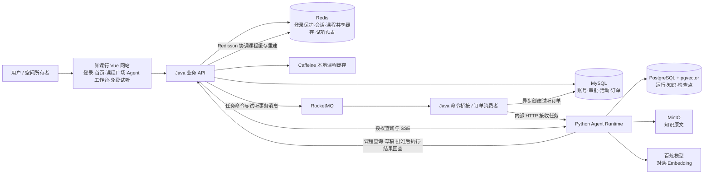

# 知课行 · AI 课程服务平台产品报告

更新日期：2026-09-29

## 产品概述

知课行提供课程浏览、智能咨询、资料问答、预约意向登记和热门课程免费试听抢课。用户登录后可以在课程广场筛选课程、查看详情，再带着课程信息进入 Agent 工作台咨询；也可以在工作空间中查询知识资料并查看回答依据。涉及业务办理时，Agent 先准备可核对的草稿，用户批准后再由业务服务执行。空间所有者可以发布限量免费试听活动，成员可直接参与，也可以让 Agent 协助查询和起草。

产品由 Vue 网站与工作台、Java 业务后端和独立 Python Agent 服务组成。工作台的“免费试听”标签提供活动运营、直接抢课与结果追踪；对话区域提供 Agent 审批办理入口。2026-09-29 已重建三个应用镜像并部署完整 Compose，17 个常驻服务运行正常；真实 `8088` 入口完成课程广场、详情、咨询预填与登录保护检查，直接抢课和 Agent 审批均形成 0 元订单，库存对账一致。当前部署使用 `fixture` 模型，详细证据见[部署验证记录](../deployment/Docker部署验证记录.md)。

## 面向谁、解决什么问题

| 用户 | 主要需求 | 对应能力 |
|---|---|---|
| 课程咨询者 | 筛选课程，了解课程、校区和资料内容 | 课程广场与详情、Agent 咨询、知识问答、来源引用 |
| 有预约意向的用户 | 核对办理信息后留下预约记录 | Agent 草稿、本人审批、预约编号回执 |
| 试听活动参与者 | 争抢有限免费试听名额并确定结果 | 活动查询、直接参与或 Agent 辅助参与、订单状态回查 |
| 工作空间所有者（OWNER） | 组织资料与试听活动 | 知识管理、活动创建/发布/暂停、对账查看 |

空间内只有 `OWNER` 与 `MEMBER` 两类角色。知识资料可在空间内共享；会话、运行和审批按本人隔离。试听活动管理只允许 OWNER，成员只能查询自己的参与结果。

## 功能全景

| 功能 | 用户能完成的事 | 当前入口 |
|---|---|---|
| 品牌首页与账户 | 查看课程服务能力、注册和登录；登录受限时显示重试倒计时 | `/`、`/login`、`/register` |
| 工作空间 | 创建和切换空间；OWNER 可通过 API 添加已注册成员 | `/agent`；添加成员为 API |
| 课程广场 | 按名称、方向和学历条件查询，按价格或学习周期排序，分页浏览并查看详情 | `/courses`、`/courses/:id` |
| 课程咨询 | 查询真实课程、校区及课程属性，继续追问 | Agent 工作台 |
| 知识问答 | 选定知识库提问，查看回答引用和 PDF 原文页码 | Agent 工作台 |
| 普通预约 | 查看课程与校区草稿，批准后获得实际预约编号 | Agent 工作台审批卡 |
| 免费试听活动 | 查看活动列表与详情，查询课程和校区；OWNER 创建、发布、暂停活动并查看对账 | `/agent`“免费试听”标签 |
| 免费试听抢课 | 直接提交参与并追踪请求结果，查看本人的抢课记录；也可批准 Agent 草稿 | `/agent`“免费试听”标签与对话审批卡 |
| 任务跟踪 | 查看流式回答、工具轨迹、等待状态；补充信息、取消、按条件重试 | Agent 工作台 |
| 知识管理与评测 | 建库、上传与预览文档、查看处理状态、失败重试；提交知识问答评测并看结果 | 工作台知识库与评测面板 |

### 登录保护与多设备会话

默认登录与注册共用每秒 20 次的请求额度，每个后端实例最多同时处理 4 个认证请求，已有账号每分钟最多 10 次登录尝试；10 分钟内密码错误 5 次后暂停 60 秒。页面收到限流或繁忙响应（429/503）时，按 `Retry-After` 显示重试倒计时，等待期间暂停提交，到期恢复按钮。

每个账号最多保留 3 个会话，超限时最早登录的会话失效；会话在有效访问后续期 24 小时。收到会话失效响应（401）后，页面清除本地 Token 并返回登录页。此次登录会话升级后原 Token 需要重新登录；会话失效不取消已经提交的 Agent 任务，重新登录后可继续查看结果或审批。

### 课程广场、咨询与有依据的问答

课程广场提供名称搜索、方向和学历筛选、价格或周期排序以及分页。详情显示课程名称、方向、学历要求、人民币元价格和学习天数；点击咨询会进入 Agent 工作台并预填课程名称与 ID，用户发送后才创建会话和任务。校区是独立的全局目录，当前没有课程与校区的开班关系。

Java 为默认首页、课程详情和固定目录使用 Caffeine 本地缓存与 Redis 共享缓存，并用 Redisson 锁合并多实例的同键缓存重建。自由筛选查询直接访问 MySQL；缓存用于低频更新的展示数据，不参与登录权限判断、审批或试听库存扣减。

用户在工作台选择普通聊天或 Agent 模式。Agent 模式能够查询 Java 业务库中的课程、校区，也能在用户有权访问的知识库中检索资料。回答保留可查看的证据引用；PDF 引用可定位原文页码，方便用户核对。聊天历史、运行步骤和最终消息分别保存，刷新页面后仍可继续查看。

知识库支持文档异步解析与向量化：只有完整处理成功的版本才参与检索；新版本处理失败不会替换已有可用内容。当前页面提供 PDF 上传、处理状态、预览、重试与删除；TXT/Markdown 是后端接口能力，页面尚无对应上传入口。扫描件 OCR 和完整版本回滚界面尚未形成产品功能。

### 普通课程预约

Agent 先从真实课程和校区中获取数据，整理学生姓名、联系方式等必要信息，生成固定的预约草稿。用户在工作台审批卡核对并选择同意或拒绝。只有同意后，Java 才复核身份、审批状态与参数，并以稳定动作编号写入一条预约意向记录；成功回执包含 `reservationId`。重复提交同一动作返回原结果。

普通预约是**意向登记**，目前没有排课时段、名额库存、支付或退款流程。Agent 的回答或运行结束本身不能代替实际预约回执。

### 热门课程免费试听抢课

OWNER 可以在工作台“免费试听”标签从现有课程和校区中选择，创建活动并设置开放时间与名额，随后发布、暂停活动并查看对账。成员可浏览活动列表和详情，在开放窗口内直接抢课，也可以在对话中让 Agent 查询活动、起草 `claim_trial` 草稿，由本人批准后提交。同一用户每场活动只能参与一次。

抢课是异步过程：提交时先取得参与请求编号，系统随后预占名额并创建 0 元试听订单。页面把“已受理”“处理中”“已确认名额”“未获得名额”区分展示，列出本人最近的参与记录，也允许按原请求编号回查；服务端记录可供刷新页面或换设备后继续查看。**只有参与请求最终为 `SUCCEEDED` 且有 `orderId`，才表示抢到试听名额**；HTTP 202、审批 `EXECUTED`、Agent 运行 `SUCCEEDED` 都不能单独证明成功。查询处理中结果无需反复发起新参与。

“免费试听”标签与 Agent 审批卡共用 Java 的权限和参与规则。活动发布后不能编辑名额、课程或时间；数据库展示的剩余量也不代表此刻一定可抢。本模块没有支付、退款或取消已确认试听订单的产品流程。

### 可追踪的 Agent 工作台

一次提问对应一条可追踪的运行。工作台显示流式回答、工具调用、引用、用量与等待状态；缺少条件时可以在同一运行中补充信息，业务草稿需要本人审批。用户可以取消任务，失败或超时时在允许的条件下重试。运行状态和事件可重放，Agent 通过持久化检查点恢复等待中的工作。取消不会撤销已经提交的预约或试听参与请求，业务结果应以 Java 的记录为准。

评测面板可提交带可选断言的知识问答样本，查看逐例答案、证据、延迟和用量汇总。没有断言的样本显示未评分，不自动计为通过。

## 产品架构图

浏览器只访问 Java 对外接口。Java 负责身份、空间权限、审批和订单事实；Python 负责 Agent 决策、知识检索及运行恢复。RocketMQ 的普通命令由 Java 桥接给 Python，试听事务消息由 Java 消费者异步落单。用户看到的流式事件由 Java 授权后转发。

## 两条典型使用路径

**从课程浏览到普通预约**：登录知课行 → 在课程广场筛选并查看详情 → 进入 Agent 工作台确认发送咨询 → 按需选择知识库、查看引用与原文 → Agent 查询真实课程/校区并生成预约草稿 → 本人批准 → 获得 `reservationId`，后续可回看运行与回执。

**从活动咨询到免费试听名额**：OWNER 在“免费试听”标签创建并发布活动 → 成员浏览详情后点击直接抢课，或让 Agent 查询活动并批准草稿 → 获得参与请求编号 → 在标签中追踪处理中状态 → 以最终 `SUCCEEDED + orderId` 确认资格，或查看 `REJECTED` 原因。

## 当前交付边界

当前产品界面覆盖课程广场与详情、咨询预填、知识引用、普通预约审批、试听活动运营、直接抢课、请求结果追踪和 Agent 试听审批。2026-09-26 已通过隔离真实 Redis/RocketMQ 的 15+3 项测试和完整 Compose 的 fixture 业务烟测，并完成真实浏览器登录、首页、工作台与试听页面导航。

2026-09-29 登录保护新增 22 项后端测试、课程目录新增 14 项后端测试通过，前端构建与 Agent 14 项隔离回归通过。同日完成完整 Compose 更新：真实 API 验证账号第 4 个会话淘汰最早 Token、退出失效与密码失败冷却；真实浏览器完成注册、重新登录、课程搜索、详情和咨询预填，预填未产生 API 写请求，页面与控制台无错误；Prometheus 观测到两级缓存命中，试听烟测再次通过。

外部模型、真实 API 的 MEMBER 浏览器权限、浏览器内 Agent 审批与会话淘汰后任务续跑、跨设备与网络故障、生产高可用和容量指标仍需单独验收。现有验证不包含 QPS、P95 或吞吐提升百分比。

更细的接口、状态和验证条件见[研发版产品功能说明书](产品功能说明书-研发版.md)、[课程目录与两级缓存](../modules/课程目录与两级缓存.md)、[试听模块设计](../modules/免费试听秒杀与Agent联动.md)及[部署验证记录](../deployment/Docker部署验证记录.md)。
