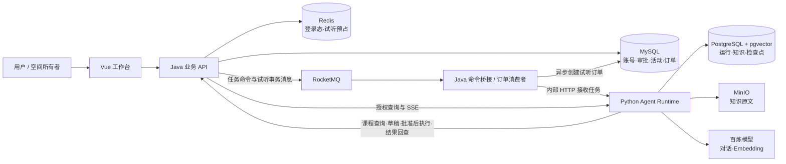

# 智能课程咨询与免费试听 Agent 平台产品报告

更新日期：2026-09-25

## 产品概述

本产品把课程咨询、资料问答、预约意向登记和热门课程免费试听抢课放在同一个工作空间中。用户可以用自然语言查询课程与知识资料，查看回答依据；涉及业务办理时，Agent 先准备可核对的草稿，用户批准后再由业务服务执行。空间所有者可以发布限量免费试听活动，成员可直接参与，也可以让 Agent 协助查询和起草。

产品由 Vue 工作台、Java 业务后端和独立 Python Agent 服务组成。当前源码与接口已实现下述功能；常用完整 Compose 应用尚未按当前配置重建验收。免费试听链路已通过隔离环境的真实中间件测试和 fixture 模型跨服务演练，尚未完成该链路的真实模型与浏览器全程验收。

## 面向谁、解决什么问题

| 用户 | 主要需求 | 对应能力 |
|---|---|---|
| 课程咨询者 | 快速了解课程、校区和资料内容 | 真实课程查询、知识问答、来源引用 |
| 有预约意向的用户 | 核对办理信息后留下预约记录 | Agent 草稿、本人审批、预约编号回执 |
| 试听活动参与者 | 争抢有限免费试听名额并确定结果 | 活动查询、直接参与或 Agent 辅助参与、订单状态回查 |
| 工作空间所有者（OWNER） | 组织资料与试听活动 | 空间成员管理、知识管理、活动发布/暂停和对账接口 |

空间内只有 `OWNER` 与 `MEMBER` 两类角色。知识资料可在空间内共享；会话、运行和审批按本人隔离。试听活动管理只允许 OWNER，成员只能查询自己的参与结果。

## 功能全景

| 功能 | 用户能完成的事 | 当前入口 |
|---|---|---|
| 账号与工作空间 | 注册登录、切换空间、创建空间；OWNER 添加已注册成员 | 页面；添加成员为 API |
| 课程咨询 | 查询真实课程、校区及课程属性，继续追问 | Agent 工作台 |
| 知识问答 | 选定知识库提问，查看回答引用和 PDF 原文页码 | Agent 工作台 |
| 普通预约 | 查看课程与校区草稿，批准后获得实际预约编号 | Agent 工作台审批卡 |
| 免费试听抢课 | 查询限量活动，批准 Agent 草稿或直接提交参与，查询最终订单 | Agent 审批卡；活动运营和直接参与为 API |
| 任务跟踪 | 查看流式回答、工具轨迹、等待状态；补充信息、取消、按条件重试 | Agent 工作台 |
| 知识管理与评测 | 建库、上传与预览文档、查看处理状态、失败重试；提交知识问答评测并看结果 | 工作台知识库与评测面板 |

### 课程咨询与有依据的问答

用户在工作台选择普通聊天或 Agent 模式。Agent 模式能够查询 Java 业务库中的课程、校区，也能在用户有权访问的知识库中检索资料。回答保留可查看的证据引用；PDF 引用可定位原文页码，方便用户核对。聊天历史、运行步骤和最终消息分别保存，刷新页面后仍可继续查看。

知识库支持文档异步解析与向量化：只有完整处理成功的版本才参与检索；新版本处理失败不会替换已有可用内容。当前页面提供 PDF 上传、处理状态、预览、重试与删除；TXT/Markdown 是后端接口能力，页面尚无对应上传入口。扫描件 OCR 和完整版本回滚界面尚未形成产品功能。

### 普通课程预约

Agent 先从真实课程和校区中获取数据，整理学生姓名、联系方式等必要信息，生成固定的预约草稿。用户在工作台审批卡核对并选择同意或拒绝。只有同意后，Java 才复核身份、审批状态与参数，并以稳定动作编号写入一条预约意向记录；成功回执包含 `reservationId`。重复提交同一动作返回原结果。

普通预约是**意向登记**，目前没有排课时段、名额库存、支付或退款流程。Agent 的回答或运行结束本身不能代替实际预约回执。

### 热门课程免费试听抢课

OWNER 可以为已有课程和校区创建活动，设置开放时间与名额，发布、暂停活动并查看对账。成员可查询活动并参与；同一用户每场活动只能参与一次。参与入口既可以是直接调用 Java API，也可以是在工作台让 Agent 查询活动、起草 `claim_trial` 草稿，由本人批准后提交。

抢课是异步过程：提交时先取得参与请求编号，系统随后预占名额并创建 0 元试听订单。前端把“已受理”“处理中”“已确认名额”“未获得名额”区分展示。**只有参与请求最终为 `SUCCEEDED` 且有 `orderId`，才表示抢到试听名额**；HTTP 202、审批 `EXECUTED`、Agent 运行 `SUCCEEDED` 都不能单独证明成功。用户可以按原请求编号继续查询，无须反复发起新参与。

目前工作台已有试听审批卡及结果展示；创建/发布活动、直接抢课、完整结果列表和对账通过 REST API 使用，尚无独立营销活动页面。本模块没有支付、退款或取消已确认试听订单的产品流程。

### 可追踪的 Agent 工作台

一次提问对应一条可追踪的运行。工作台显示流式回答、工具调用、引用、用量与等待状态；缺少条件时可以在同一运行中补充信息，业务草稿需要本人审批。用户可以取消任务，失败或超时时在允许的条件下重试。运行状态和事件可重放，Agent 通过持久化检查点恢复等待中的工作。取消不会撤销已经提交的预约或试听参与请求，业务结果应以 Java 的记录为准。

评测面板可提交带可选断言的知识问答样本，查看逐例答案、证据、延迟和用量汇总。没有断言的样本显示未评分，不自动计为通过。

## 产品架构图

浏览器只访问 Java 对外接口。Java 负责身份、空间权限、审批和订单事实；Python 负责 Agent 决策、知识检索及运行恢复。RocketMQ 的普通命令由 Java 桥接给 Python，试听事务消息由 Java 消费者异步落单。用户看到的流式事件由 Java 授权后转发。

## 两条典型使用路径

**从资料问答到普通预约**：进入工作空间 → 选择知识库并咨询课程 → 查看引用与原文 → Agent 查询真实课程/校区并生成预约草稿 → 本人批准 → 获得 `reservationId`，后续可回看运行与回执。

**从活动咨询到免费试听名额**：OWNER 发布活动 → 成员让 Agent 查询活动并起草，或直接经 API 参与 → 本人批准 Agent 草稿 → 获得参与请求编号 → 查询处理中状态 → 以最终 `SUCCEEDED + orderId` 确认资格，或查看 `REJECTED` 原因。

## 当前交付边界

当前产品可以展示咨询、知识引用、普通预约审批以及试听审批与结果查询的功能闭环。试听活动运营和直接抢课尚需独立前端页面；常用完整部署、真实模型试听端到端、生产高可用及容量指标仍需单独验收。产品演示中的并发数据来自合成参与者的隔离测试，不代表真实用户规模。

更细的接口、状态和验证条件见[研发版产品功能说明书](产品功能说明书-研发版.md)、[试听模块设计](../modules/免费试听秒杀与Agent联动.md)及[验证记录](../modules/免费试听秒杀验证记录.md)。
