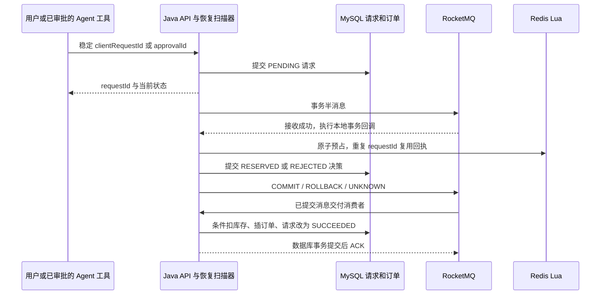

# 参考秒杀实现与迁移差异

审查日期：2026-09-25。参考仓库为 `D:\java\Redis\social-e-commerce-platform`；目标为本仓库。本文依据两个仓库实际源码说明迁移取舍，不把依赖、设计文档或单元测试当作已经上线的能力。参考仓库只读审查，没有运行其服务，也未修改其文件。

## 1. 版本与接入方式

| 项目 | 参考仓库 | 当前项目 |
|---|---|---|
| Java / Spring Boot | Java 8 / Boot 2.3.12.RELEASE | Java 21 / Boot 4.1.1 |
| RocketMQ Java 接入 | `rocketmq-spring-boot-starter:2.2.3` | `rocketmq-client:5.5.1` 原生 remoting client，显式管理启动和关闭 |
| Broker 镜像 | `apache/rocketmq:5.3.2` | `apache/rocketmq:5.5.0`，固定 digest |
| 持久层 | MyBatis-Plus 3.4.3，MySQL connector 5.1.47 | 试听模块用 Spring JDBC 事务、Flyway 迁移与 MySQL |
| 默认消息路径 | `MQ_MODE` 默认为 `redis`，RocketMQ 是可切换分支 | Compose 默认开启 RocketMQ；关闭时 Agent 命令可走 HTTP，试听抢课不可静默降级 |

版本证据：[参考 pom.xml](D:/java/Redis/social-e-commerce-platform/pom.xml:8)、[参考 MQ 配置](D:/java/Redis/social-e-commerce-platform/src/main/resources/application.yaml:33)、[参考部署](D:/java/Redis/social-e-commerce-platform/deploy/rocketmq/docker-compose.yml:3)、[当前 pom.xml](../../pom.xml:8)、[当前 Compose](../../docker-compose.yml)。

原生 client 避免直接引入面向旧 Boot 的 starter 自动配置，不代表上游对本项目的全部依赖组合做过兼容认证。5.5.1 client 的 Maven 构件可获取，但本次检查官方镜像仓库未提供 `apache/rocketmq:5.5.1` 标签，因此 Broker 固定为已获取 digest 的 5.5.0。当前 Boot BOM 的 Netty 版本仍由项目统一管理，真实连接验证应与编译验证分别记录。[Apache 版本发布记录](https://rocketmq.apache.org/release-notes/2026/08/20/5.5.1/)

## 2. 参考仓库实际怎样运行

### 2.1 请求与半消息

`VoucherOrderServiceImpl.seckillVoucher` 获取登录用户，为每次调用生成新的订单 ID，再按 `mq.mode` 选择 Redis Stream 或 RocketMQ。RocketMQ 分支调用 `VoucherOrderMessageProducer.sendMessageInTransaction`，以订单 ID 为消息 key，携带订单、用户、优惠券等字段。发送成功后通过本次调用上下文读取 Lua 结果：成功返回订单 ID，无法确定时返回“状态确认中”，此分支没有在该返回中提供可查询的订单 ID。

证据：[请求入口与事务消息分支](D:/java/Redis/social-e-commerce-platform/src/main/java/com/hmdp/service/impl/VoucherOrderServiceImpl.java:117)、[生产者](D:/java/Redis/social-e-commerce-platform/src/main/java/com/hmdp/mq/producer/VoucherOrderMessageProducer.java:30)、[消息结构](D:/java/Redis/social-e-commerce-platform/src/main/java/com/hmdp/mq/message/VoucherOrderMessage.java)。

### 2.2 Lua 预占

`VoucherOrderTransactionListener.executeLocalTransaction` 在半消息发送后调用 `SeckillReservationService.reserve`。Lua 做以下操作：

1. 同一用户、优惠券的 reservation 值已等于本订单 ID，返回成功，避免同订单重复扣减。
2. 库存缺失或不足，返回 `1`；用户已在领取集合，返回 `2`。
3. 原子执行库存减一、用户加入集合、写入带 TTL 的预约记录，成功返回 `0`。

本地回调把 `0` 映射为 COMMIT，其他业务结果映射为 ROLLBACK，异常映射为 UNKNOWN。实际 key 为 `seckill:stock:<voucher>`、`seckill:order:<voucher>`、`seckill:reservation:<voucher>:<user>`；脚本从 ARGV 拼接 key，Java 执行时传空 KEYS。预约记录默认 7 天过期，领取集合没有相同的过期操作。脚本未校验活动起止时间，尽管优惠券持久记录中存在时间字段。

证据：[参考 Lua](D:/java/Redis/social-e-commerce-platform/src/main/resources/seckill-rocketmq.lua:10)、[脚本调用与回执检查](D:/java/Redis/social-e-commerce-platform/src/main/java/com/hmdp/mq/transaction/SeckillReservationService.java:42)、[本地事务回调](D:/java/Redis/social-e-commerce-platform/src/main/java/com/hmdp/mq/transaction/VoucherOrderTransactionListener.java:34)、[活动发布](D:/java/Redis/social-e-commerce-platform/src/main/java/com/hmdp/service/impl/VoucherServiceImpl.java:45)。

### 2.3 事务回查

`checkLocalTransaction` 只检查 Redis reservation key 是否等于订单 ID：匹配则 COMMIT，不匹配则 ROLLBACK，Redis 查询异常才 UNKNOWN。没有 MySQL 请求决策日志作为回查依据，也没有在回查中重新执行 Lua。

这一实现的问题是“回执不存在”和“预占明确失败”不是同一事实。TTL 到期或缓存数据丢失后，原先成功扣减的请求也可能被判为 ROLLBACK；不应把 Redis miss 本身作为否定预占的可靠证明。当前 Redis key 组织与空 KEYS 调用也不适合直接迁移到 Redis Cluster，需要显式声明 key 并保证同槽。

证据：[回查实现](D:/java/Redis/social-e-commerce-platform/src/main/java/com/hmdp/mq/transaction/VoucherOrderTransactionListener.java:57)、[Redis 判据](D:/java/Redis/social-e-commerce-platform/src/main/java/com/hmdp/mq/transaction/SeckillReservationService.java:56)。

### 2.4 异步落单与幂等

`VoucherOrderConsumer` 使用集群消费，最大重试次数为 16，将消息映射为订单后调用注入的 `IVoucherOrderService.createVoucherOrder`。该事务方法先按订单主键查重，再检查用户与优惠券是否已有订单，随后以 `stock > 0` 为条件扣减 MySQL 库存并插入订单。

参考库**已有** `UNIQUE(user_id, voucher_id)`，不是只靠应用层先查再写。并发重复插入触发约束时，本地事务会回滚相应扣减。参考项目还存在 Redisson 用户锁，但它位于 Redis Stream 的 `handleVoucherOrder` 路径；RocketMQ 消费者直接调用事务落单方法，不能宣称该分支同时使用了这把锁。

证据：[消费者](D:/java/Redis/social-e-commerce-platform/src/main/java/com/hmdp/mq/consumer/VoucherOrderConsumer.java:13)、[事务落单与 Stream 专用锁](D:/java/Redis/social-e-commerce-platform/src/main/java/com/hmdp/service/impl/VoucherOrderServiceImpl.java:171)、[订单唯一约束](D:/java/Redis/social-e-commerce-platform/src/main/resources/db/hmdp.sql:1271)、[存量数据迁移](D:/java/Redis/social-e-commerce-platform/src/main/resources/db/rocketmq-migration.sql:4)。

### 2.5 补偿边界

参考 RocketMQ 分支没有发现预占释放脚本、持久请求恢复扫描器或消费进入 DLQ 后的自动业务补偿。迁移文档提出 DLQ、Redis 预约与 MySQL 订单对账等监控建议，这些建议不能算作已实现的补偿服务。库存发布在一个数据库事务方法内写 SQL 后再写 Redis，也不构成数据库与 Redis 的分布式原子提交。

参考测试主要是模拟 reservation service、消费者 service 的单元测试；本次没有执行参考仓库真实 Broker、Redis、MySQL 的联调。[参考迁移文档](D:/java/Redis/social-e-commerce-platform/docs/rocketmq-migration.md)、[事务监听器测试](D:/java/Redis/social-e-commerce-platform/src/test/java/com/hmdp/mq/transaction/VoucherOrderTransactionListenerTest.java)。

## 3. 当前模块保留的主链路

当前实现仍然遵循用户指定模式：**RocketMQ 半消息 → 事务回调 Lua 预占 Redis → 提交消息 → 消费者异步落单**。Lua 负责一次预占内的库存与参与资格原子性，MySQL 负责最终业务记录、唯一约束和库存条件更新。事务消息不能使 Redis、Broker、MySQL 三者形成一个原子事务，也不保证消费者只执行一次；重复投递是正常路径。

新增的持久请求记录位于半消息之前：API 先创建 `PENDING` 请求并返回稳定 `requestId`；扫描器取得待处理请求后发送事务消息。即使进程在 API 返回后、半消息发送前退出，请求仍然可恢复。消息体只含版本和 requestId，消费时从可信数据库记录取得实际活动、用户与工作区。

来源：[TrialMessaging](../../src/main/java/com/chy/zhikexing/trial/TrialMessaging.java)、[TrialService](../../src/main/java/com/chy/zhikexing/trial/TrialService.java)、[事务消息官方语义](https://rocketmq.apache.org/docs/featureBehavior/04transactionmessage/)。

## 4. 逐项迁移取舍

| 主题 | 当前实现 | 修改原因与代价 |
|---|---|---|
| 业务对象 | 独立的免费试听活动、请求、订单；金额约束为 0 | 不把领取资格、普通课程预约或付费支付混为一个状态机 |
| 请求幂等 | 工作区、用户、来源、clientRequestId 联合唯一；同键不同活动冲突；活动与用户唯一 | 网络重试返回原请求；当前规则是一人一活动一条申请，终态拒绝也不自动允许重新申请 |
| 预占前日志 | MySQL 提交 PENDING 后再发半消息 | 覆盖发送前宕机与响应丢失；代价是每个新请求都会访问 MySQL，不能宣传“请求在落单前完全不打数据库” |
| Redis key | 通过 KEYS 显式传入 inventory、holders、receipts，使用同一 `{campaignId}` hash tag | 满足同槽脚本要求；这是 key 设计准备，单节点测试不能代表已验证 Redis Cluster 故障切换 |
| 活动准入 | API 检查状态和时间；Lua 再使用 Redis TIME 校验活动窗口与暂停状态 | 缩小并发与时钟差异造成的越界准入；已有 RESERVED 回执可继续完成，不因暂停追溯撤销 |
| 回执持久性 | 预占回执不自动过期，Redis 开启 AOF、noeviction | 不让正常过期破坏事务判据；需监控容量，后续清理应基于活动终态、消息保留期与业务对账，不任意加 TTL |
| 缓存缺失 | 库存未就绪、同请求 holder 存在但回执缺失等返回 NOT_READY；事务结果 UNKNOWN | 缺失不冒充“明确失败”；活动进入 LIVE 后禁止自动以原库存覆盖重建 |
| 事务回查 | 只读 MySQL 决策：RESERVED/SUCCEEDED 提交，REJECTED 回滚，PENDING 未知 | Broker 回查不创建新的抢课事实；没有请求记录的消息回滚。Redis 已预占而日志未提交时，由恢复重发与幂等 Lua 补齐决策 |
| 恢复扫描 | PENDING / RESERVED 领取时推迟下一次尝试 30 秒，重发同 requestId 事务消息 | 覆盖发送前故障、半消息回查次数耗尽和消费长期失败；存在重复消息，依赖幂等收敛，不声称严格一次投递 |
| 最终库存与订单 | 请求行锁；MySQL 条件减库存、订单插入、SUCCEEDED 在同一本地事务内完成 | 最终防超卖由数据库条件与约束共同保障；Redis 是预占层，不是最终订单账本 |
| 补偿 | 数据库库存不足时标记 REJECTED + release_pending；独立扫描执行 Lua 释放 | 避免在数据库事务中假设跨 Redis 提交原子性；释放失败留待重试 |
| 释放幂等 | Lua 返回 1=本次释放，0=已释放，-1=缺失或不一致；只对前两者清除待补偿标记 | 不把缓存丢失误当作释放成功；需要人工处理的异常仍有持久记录 |
| 权限与审批 | 工作区成员才能申请；OWNER 发布、暂停、对账；Agent 的 claim_trial 审批绑定 run/action/用户与参数 | APPROVED 只授权提交申请；EXECUTED 表示审批已用于发起业务请求，不代表已经抢到名额 |
| 状态查询 | requestId 查询异步业务结果，限制工作区与申请用户；Agent 可按 action 查询 | 用户能区分 PENDING、RESERVED、SUCCEEDED、REJECTED，避免将排队受理误报为成功 |

实现位置：[V5 表结构](../../src/main/resources/db/migration/V5__trial_flash_sale.sql)、[TrialInventory](../../src/main/java/com/chy/zhikexing/trial/TrialInventory.java)、[预占 Lua](../../src/main/resources/lua/trial-reserve.lua)、[释放 Lua](../../src/main/resources/lua/trial-release.lua)、[Agent 审批集成](../../src/main/java/com/chy/zhikexing/trial/TrialAgentService.java)。

## 5. 仍需明确的故障边界

Redis AOF `everysec` 与 `noeviction` 分别降低正常故障下的数据丢失概率、避免内存淘汰，不构成跨系统强一致或零丢失承诺。缓存丢失时，已经持久化 RESERVED 的请求仍按数据库决策完成；尚未持久化预占决策的请求可能保持 PENDING，需要停止新准入、等待在途处理、对账后修复。当前代码没有自动从数据库重建所有丢失的 Redis 预占事实。

活动发布也跨越 MySQL 与 Redis：先初始化库存再提交 LIVE，靠 DRAFT 状态与不覆盖已有库存的初始化规则限制重复操作。它不是 XA 事务，异常恢复仍需检查两侧事实。

对账接口同时展示 MySQL 库存、订单、待处理请求和 Redis 状态，其中“容量 = 数据库剩余 + 成功订单数”是数据库侧不变量；两套存储的读数不在同一快照内。运行中短时差异不能直接触发库存覆盖或自动释放。

试听恢复扫描器会重发未达终态的请求，能在故障恢复后推动原消费重试耗尽的申请；仍需监控积压、attempts、补偿待办和 DLQ。永久数据错误不会因为持续重发自动消失，系统也没有实现任意损坏数据的自动修复。

取消 Agent run 只阻止新的工具申请，不撤销已经受理的免费报名。该边界在审批提示中说明；如后续添加退订，应设计独立授权、订单状态机与补偿流程。

## 6. 普通 Agent 命令与试听事务消息不是同一条路径

| 属性 | 普通 Agent 命令 | 免费试听 |
|---|---|---|
| Topic | `zhikexing-agent-commands`，NORMAL | `zhikexing_trial_claims`，TRANSACTION |
| 生产组 / 消费组 | `zhikexing-agent-command-producer` / `zhikexing-agent-command-consumer` | `zhikexing_trial_tx_v1` / `zhikexing_trial_order_v1` |
| 投递持久记录 | Java outbox | trial_claim_request |
| 消费后续 | Java 顺序消费者调用 Python HTTP | Java 消费者落 MySQL 试听订单 |
| ACK 条件 | Python 幂等接收，Run/取消状态事务提交并返回 2xx | MySQL 业务事务完成 |
| 业务恢复 | outbox 发送失败可重试；已 DELIVERED 的普通命令进入 DLQ 后按手册人工重驱 | PENDING / RESERVED 恢复扫描，终态拒绝执行释放补偿 |

Python 当前通过 Run 主键、request_hash 及持久化状态接收命令，没有独立 inbox 表。普通命令并不执行试听 Lua；Java 运行时桥接避免了为 Python 进程部署 RocketMQ 原生客户端的额外依赖。固定 run 的队列选择与顺序消费只约束同队列实际投递顺序，不能代替应用数据库中的生命周期校验。

普通命令 outbox 的 DELIVERED 表示 Broker 接收，并不表示 Runtime 已完成任务。若命令最终进入 DLQ，原 outbox 不会自动恢复 PENDING；应先修复根因，再按 commandId 对照运行时状态，使用单条重驱脚本重发相同命令，不能批量复位全部 DELIVERED。详见[部署恢复说明](../../docs/deployment/Docker部署文档.md)、[单条重驱 SQL](../../deploy/rocketmq/redrive-agent-command.sql)。

## 7. 验证与可陈述范围

本文的参考代码结论来自静态阅读；未对参考仓库做压力测试或可用性演练。当前迁移已经分别进行编译、Compose 配置和 shell 语法检查；本次开发另有隔离 Broker / MySQL / Redis 集成测试，实际命令、通过数量与故障注入结果以开发验证报告为准。测试文件按本次开发约定可在验证结束后移除，本文不以临时测试文件是否保留作为能力证据。

可说明的是明确的消息时序、决策日志、幂等边界、库存不变量和已执行的验证；没有测量前不填写 QPS、延迟分位数、集群可用性或线上规模。事务消息机制本身也不能替代订单幂等与异常恢复。[Apache 事务消息使用文档](https://rocketmq.apache.org/docs/4.x/producer/06message5/)
